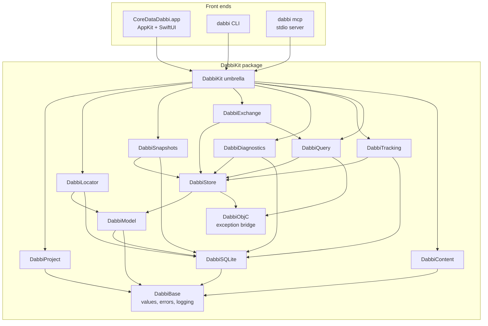

# CoreDataDabbi — Architecture

| | |
|---|---|
| **Status** | Draft v1.0 · 2026-09-20 |
| **Companion docs** | [PRD v1.1](PRD.md) · [Implementation plan](IMPLEMENTATION_PLAN.md) |
| **Scope** | The engine (`DabbiKit`), the macOS app, the `dabbi` CLI and the MCP server |
| **Validated on** | macOS 26.4.1 · Xcode 26.4.1 · Swift 6.3.1 (see Appendix A for spike results, Appendix B for what M0 added, Appendix C for M1) |

This document says *how* the product in the PRD is built: module boundaries, the types that cross them, the concurrency model, the algorithms that carry the non-functional targets, and where the risky private-format knowledge is quarantined. The *when* is in the implementation plan.

---

## 1. Architectural drivers

| # | Driver (PRD ref) | Consequence for the design |
|---|---|---|
| D1 | Zero-instrumentation (§4 G1, TRK-3) | Everything is derived from files on disk plus Apple tooling (`simctl`, `devicectl`). Change tracking is file watching + diffing, never injected code. |
| D2 | Model-faithful (§4 G2) | **Core Data itself is the read/write path for object data** — it gives authoritative decoding, composites, external storage and validation for free. Raw SQLite is auxiliary (change detection, console, stats, raw mode). |
| D3 | Safe by default (§4 G3, §5) | Read-only open; write API gated by a capability token; staged edits; verified backup before first commit; short read transactions only. |
| D4 | Fast on big stores (§10) | ID-list + windowed paging, value-type rows, AppKit grid, no per-cell fetches, no `NSManagedObject` in the UI. |
| D5 | One engine, three front ends (§9.1) | UI-free package with a `Sendable` value-type API; the CLI exists from M0 as the engine's test harness. |
| D6 | Private on-disk details may change (§15) | All private-format knowledge lives in two modules (`DabbiSQLite` users: `SchemaMap`, `RawHistoryReader`) behind a capability probe, each with a Core-Data-only path beside it: the scan's is a Core Data refetch, the raw history reader's is `NSPersistentHistoryChangeRequest`, which is also the preferred one. Every format assumption either module makes is asserted by `FormatCanaryTests` against a real store. |
| D7 | Untrusted input (§9.8, §14) | Parse, never unarchive, attribute data; bounded decoders; hardened SQLite connection; locked-down web view. |
| D8 | Contributor-friendly (§4 G7, §14) | Protocol plug-points (decoders, exporters, Doctor checks); no secrets, no project generators; clone → open → run. |

---

## 2. Key decisions (ADR summary)

Each row becomes a short ADR file under `docs/adr/` when the repo is bootstrapped. "Assumed" = adopts the PRD's proposed answer to an open question (§16); revisit if the owner decides otherwise.

| ID | Decision | Why | Status |
|---|---|---|---|
| ADR-01 | **Hybrid data path**: Core Data for object values and all writes; raw SQLite only for change detection, SQL console, stats, history fallback, raw mode. | D2 + D6: minimises the private-format surface to table names, `Z_PK/Z_ENT/Z_OPT`, join tables. | Accepted |
| ADR-02 | **Engine API is `Sendable` value types.** `NSManagedObject`, contexts and coordinators never cross `StoreSession`'s public API. | Swift 6 strict concurrency; same API serves GUI, CLI, MCP; rows are cheap to cache and diff. | Accepted |
| ADR-03 | `StoreSession` and `ChangeTracker` are **actors**; Core Data work runs inside `await context.perform {}` and returns DTOs. | Data-race safety without `@unchecked Sendable` leakage. | Accepted |
| ADR-04 | One SwiftPM package, **multiple targets** with enforced layering, one umbrella product `DabbiKit`. Cross-target internals use the `package` access level. | Layering is compiler-checked; decoders can be fuzzed alone; public API stays small. | Accepted |
| ADR-05 | **AppKit lifecycle + `NSDocument`**; SwiftUI hosted (`NSHostingView`) for inspector forms, settings, wizards, welcome. Not `DocumentGroup`. | Tabs/versions/package documents, `NSTableView`, `NSPredicateEditor`, responder-chain menus all need AppKit control. | Accepted |
| ADR-06 | Committed `.xcodeproj` (folder-synchronised groups) that references the local package. No XcodeGen/Tuist. | Clone → open → run with zero extra tools. | Accepted |
| ADR-07 | System SQLite via `import SQLite3` and a thin in-house wrapper. No GRDB/SQLite.swift. | We need only prepared statements, authorizer, interrupt, backup API; PRD §14 wants few deps and the system library. | Accepted |
| ADR-08 | Own **binary-plist + keyed-archive parser**; `NSKeyedUnarchiver` is never run on attribute data. | `PropertyListSerialization` hides `CFKeyedArchiverUID` values behind private types; own parser is bounded, fuzzable, safe. | Accepted |
| ADR-09 | The sanitiser gives **every** transformable attribute the pass-through transformer — not only unknown names. | A `nil` transformer name means Core Data's default secure-unarchive transformer, which would instantiate classes from untrusted data. Spike: hashes unaffected. | Accepted |
| ADR-10 | Tracker strategy: ~~**persistent-history-first**~~, `Z_PK/Z_OPT` scan, join-table diff for to-many; changed rows materialised through Core Data. | Exact and cheap when history exists; universal otherwise. | **Amended by ADR-18** |
| ADR-11 | The staging area for edits **is** the editable context's unsaved change set + its `UndoManager`. | No parallel change model to keep in sync; validation and pending-change display come from Core Data. | Accepted |
| ADR-12 | Writes require a `WriteAuthorization` value that only the app and `dabbi --allow-writes` can mint; the MCP target cannot construct one. | "Writes are never exposed over MCP" becomes a compile-time property. | Accepted |
| ADR-13 | `.dabbi` is a JSON **package**, schema-versioned, with machine-local state (bookmarks, window state) separable from shareable state. | Diffable, committable, team-friendly (PRD §9.6, open question 4). | Accepted |
| ADR-14 | macOS 14 minimum, Swift 6 language mode, MIT licence, Observation framework for view models. | PRD proposals (§16 Q1, Q2). macOS 14 is needed for composites and gives `@Observable`. | Assumed |
| ADR-15 | Diagram auto-layout and text exporters (SVG, Mermaid, DOT) live in the engine; PDF/PNG rendering in the app. | CLI can emit diagrams; layout is unit-testable. | Accepted |
| ADR-16 | The CLI target is created in M0 (`describe`, `query`) and hardened into the product CLI in M6. | Headless exit criterion for M0; agents and CI use it from day one. | Accepted |
| ADR-18 | **The scan decides what changed; history says who changed it.** `ChangeScanner` is the only answer to which rows changed; persistent history is read as well and never instead, supplying author, save time and the property names of a row nobody had read. A scanned row history cannot account for is a reported limitation. | `NSPersistentHistoryTrackingKey` is per store *open*, not per file: a store can carry history tables and still be written with tracking off, so history-first would lose those saves in silence (ADR-17). Being wrong this way costs one missing author; being wrong the other way costs the change. | Accepted |
| ADR-17 | **Unknown is a reported state, never a guess.** A prior value nobody holds, a view membership nobody knows and an attribute only one side of a diff carries are each reported as unknown — `nil` `changedKeys` as against empty, no transition, not compared. | An empty before-column reads as "it used to be blank" and a missing member as "it has just arrived": plausible wrong stories cost more than a visible gap (§6.6, App. D). | Accepted |

---

## 3. System overview

### 3.1 Components



Layering rule: arrows only point down. `DabbiContent` and `DabbiProject` depend on nothing but `DabbiBase`, so they can be built, tested and fuzzed in isolation. No engine target imports AppKit or SwiftUI (CI greps for it).

### 3.2 Repository layout

```
CoreDataDabbi/
├─ Package.swift                  DabbiKit targets, dabbi executable, tools
├─ Sources/
│   ├─ DabbiBase/  DabbiObjC/  DabbiSQLite/  DabbiModel/  DabbiStore/
│   ├─ DabbiQuery/ DabbiTracking/ DabbiLocator/ DabbiContent/
│   ├─ DabbiExchange/ DabbiSnapshots/ DabbiDiagnostics/ DabbiProject/
│   ├─ DabbiKit/                  umbrella: @_exported imports + DocC catalog
│   └─ dabbi/                     CLI (swift-argument-parser) incl. `mcp` subcommand
├─ Tests/                         one test target per engine target
├─ App/
│   ├─ CoreDataDabbi.xcodeproj    references ../Package.swift
│   ├─ CoreDataDabbi/             app sources, Info.plist, assets, String Catalogs
│   ├─ CoreDataDabbiUITests/
│   └─ Config/                    Base.xcconfig, `#include? "Local.xcconfig"` for signing
├─ Tools/
│   ├─ FixtureGen/                executable: generates the fixture zoo
│   └─ Writer/                    scripted writer: macOS CLI + iOS simulator app
├─ Fixtures/                      generated output (git-ignored)
├─ Scripts/                       fixtures.sh, release.sh, notarize.sh, appcast.sh
├─ docs/                          PRD, this file, plan, adr/, DocC site sources
└─ .github/                       workflows, issue/PR templates, labels.yml
```

### 3.3 PRD component ↔ target mapping

Targets are prefixed (`Dabbi…`) because SwiftPM module names must be unique across a consumer's whole dependency graph; generic names like `Snapshots` would collide.

| PRD §9.1 name | Target | Notes |
|---|---|---|
| StoreLocator | `DabbiLocator` | |
| ModelLoader | `DabbiModel` | also owns `SchemaMap`, `ModelDescription`, model diff |
| StoreSession | `DabbiStore` | paging, values, staged edits, backups trigger |
| RawSQLite | `DabbiSQLite` | connection wrapper only; *users* of it hold the private-format knowledge |
| ChangeTracker | `DabbiTracking` | includes `HistoryReader` |
| QueryEngine | `DabbiQuery` | predicates, templates, global search, code generation |
| ImportExport | `DabbiExchange` | |
| Snapshots | `DabbiSnapshots` | backup-API copy, restore, store diff |
| ContentDecoders | `DabbiContent` | |
| — (new) | `DabbiBase`, `DabbiObjC`, `DabbiProject`, `DabbiDiagnostics` | shared values/errors · ObjC exception bridge · `.dabbi` format · stats + Doctor + diagram layout |

---

## 4. Engine boundary types (`DabbiBase`)

Everything a front end sees is a `Sendable`, `Codable` value. These types are the stable API contract of `DabbiKit` (semver'd; `0.x` until app 1.0; experimental API behind `@_spi(Unstable)`).

```swift
public struct ObjectRef: Sendable, Hashable, Codable {       // identity of one managed object
    public let entity: String
    public let pk: Int64                                      // Z_PK, from the URI's last component ("p42")
    public let uri: URL                                       // x-coredata://<store-uuid>/<Entity>/p42
}

public enum Value: Sendable, Hashable, Codable {
    case null                                                 // rendered distinctly from "" (BRW-4)
    case bool(Bool), int(Int64), double(Double), decimal(Decimal), string(String)
    case date(Date)                                           // raw TimeInterval derivable for hover
    case uuid(UUID), url(URL)
    case blob(BlobSummary)                                    // binary + transformable: never inlined in pages
    case composite([String: Value])
    case toOne(ObjectRef?, display: String?)
    case toMany(count: Int)
}

public struct BlobSummary: Sendable, Hashable, Codable {
    public let byteCount: Int
    public let sniffedType: ContentTypeID?                    // from the first 64 bytes only
    public let isExternal: Bool                               // "Allows External Storage"
}

public struct RowSnapshot: Sendable { public let ref: ObjectRef; public let values: [Value] }   // order = ColumnSet
public struct RowPage:     Sendable { public let range: Range<Int>; public let rows: [RowSnapshot]; public let generation: Int }

public struct FetchSpec: Sendable, Hashable, Codable {
    public var entity: String
    public var includeSubentities = true                      // BRW-6
    public var predicate: PredicateSource?                    // format string + parsed AST
    public var sort: [SortKey] = []                           // empty = object-ID order (BRW-11)
    public var limit: Int?
}
```

`ModelDescription` is a complete value-type mirror of `NSManagedObjectModel` (entities, inheritance, attributes with all validation facets, relationships, indexes, uniqueness constraints, user info, renaming IDs, version hashes, fetch-request templates). It feeds the sidebar, the entity inspector, predicate autocomplete, diagrams, model diff, `dabbi describe` and the MCP `describe_model` tool from one source.

`DabbiError` carries a machine code, a plain-language message, a *diagnosis* (what we looked for, where) and *recovery suggestions* — the PRD's "instructive empty/error states" (§8.1) are rendered straight from it.

---

## 5. Concurrency and lifecycle

- Swift 6 language mode, complete strict-concurrency checking, in every target.
- **`StoreSession` (actor)** owns one `NSPersistentStoreCoordinator` and its contexts. Public methods are `async`, do their Core Data work inside `try await context.perform { … }`, convert to DTOs *inside* the closure, and return only DTOs.
- Contexts, all private-queue, `stalenessInterval = 0`, fetches with `shouldRefreshRefetchedObjects = true`:

  | Context | Exists when | Used for |
  |---|---|---|
  | `browse` | always | pages, counts, relationship lookups, blob loads |
  | `track` | tracking active | materialising changed rows without disturbing `browse` |
  | `edit` | access mode = Editable | staged edits with `UndoManager`; in Editable mode browsing also goes through it so pending values show in the grid |

- **Generations.** Anything that invalidates row positions (mode switch, commit, refetch, auto-repair re-open) bumps `session.generation`. Pagers and pages carry the generation; stale pages are dropped by the UI.
- **Access-mode switch** (EDT-1) = tear down the coordinator and rebuild it with different store options. It is not a flag flip, because `NSReadOnlyPersistentStoreOption` is an open-time option.
- **UI** view models are `@MainActor @Observable`. AppKit data sources read synchronously from a main-actor page cache and request misses asynchronously.
- **Streams.** Long-running producers (store search, global search, tracking, import progress) return `AsyncThrowingStream`; cancellation is task cancellation. SQLite work is interrupted via `sqlite3_interrupt` from the cancellation handler.
- **Subprocesses** (`xcrun …`) go through one `ProcessRunner` protocol: JSON output modes only, timeouts, test doubles.

---

## 6. Engine modules

### 6.1 `DabbiObjC` — exception bridge

One Objective-C function, `DBTryCatch(block, &error)`, that converts `NSException` into `NSError`. Required because `NSPredicate(format:)`, fetch execution with bad key paths, KVC on unknown keys and `predicate.evaluate(with:)` raise ObjC exceptions that Swift cannot catch (PRD §7.1). Rule: keep the guarded block tiny (one Foundation/Core Data call) — unwinding through Swift frames is not memory-safe in general.

### 6.2 `DabbiSQLite` — the raw connection

- `SQLiteConnection`: non-`Sendable` final class, always confined to an actor (`SQLiteReader`).
- Opened `SQLITE_OPEN_READONLY`, then `PRAGMA query_only = 1`, `PRAGMA trusted_schema = OFF`, `SQLITE_DBCONFIG_DEFENSIVE`, small busy timeout (250 ms), statement/row limits via `sqlite3_limit`.
- **Short read transactions only.** A reader that keeps a transaction open pins the WAL and stops the inspected app's checkpoints from completing. No transaction is ever held across an `await`.
- **Authorizer** (`sqlite3_set_authorizer`) allow-lists `SELECT`/`READ`/`FUNCTION` for the SQL console; denies `ATTACH`, write pragmas, and everything else — defence in depth on top of the read-only handle.
- Progress handler + `sqlite3_interrupt` for cancellation and runaway-query timeouts.
- Backup API wrapper (`sqlite3_backup_*`) used by `DabbiSnapshots`.
- Header sniff: not `SQLite format 3\0` → *encrypted or not SQLite* error (SQLCipher message, PRD §9.3). No `Z_METADATA` → offer raw mode (PRJ-13).
- **Read-only WAL caveat** (M0's reading of it was wrong; corrected in M1 — Appendix C): SQLite decides that a database is in WAL mode from the mere existence of a `-wal` file, and a WAL database needs its `-shm`. The unix VFS opens that file `O_RDWR|O_CREAT` *even for a read-only connection*. So when the `-shm` is missing, a read-only open — the system SQLite's and Core Data's with `NSReadOnlyPersistentStoreOption` alike — **creates one (32 KB) next to the user's store** when the folder is writable, and fails with `SQLITE_CANTOPEN` (Core Data: error 256) when it is not. The first connection of any kind also rebuilds the index inside an existing `-shm`, so its bytes change under a pure reader; that is shared memory doing its job, not a write to the store. `immutable=1` is no way out: Core Data cannot be handed URI parameters. A rollback-journal database has no such needs and opens read-only anywhere, including a read-only folder. Three consequences:
  - **The guard.** `SQLiteConnection.requireReadableInPlace(_:)` refuses a database that has a `-wal` and no `-shm` with `.readOnlyLocation` *before* SQLite or Core Data touches it; `SQLiteConnection(readOnly:)` and `StoreMetadata.read` both call it. CoreDataDabbi never writes next to a store it was asked to look at, whether or not the folder would let it.
  - `SQLiteBackup` switches its destination to `journal_mode = DELETE`, so every snapshot is one self-contained file. Core Data puts a store back into WAL mode by itself the next time it opens it read-write.
  - **The working copy** (`WorkingCopy` in `DabbiLocator`, `StoreOpener` in `DabbiKit`). For stores that cannot be opened in place (a copied store without its `-shm`, mounted images, locked-down `.xcappdata`), the store, `-wal`, `-shm` (when present) and the external-data folder are file-copied into `~/Library/Caches/org.coredatadabbi/WorkingCopies/<UUID>/`. `SQLiteConnection.consolidate(ownedCopyAt:)` opens **the copy** read-write once — it is ours — checkpoints (`TRUNCATE`), switches to `journal_mode = DELETE`, and removes the `-shm` Apple's SQLite leaves behind even then. The result reads anywhere. `StoreOpener` does this on `.readOnlyLocation` and on nothing else, `OpenedStore` says that it is a copy (the status capsule shows it), closing removes it, and copies a crash left behind are swept at launch.

### 6.3 `DabbiModel` — models without the app's code

**Resolution pipeline** (PRJ-3/4/5/7/11), first success wins, result labelled with its `ModelSource`:

1. User-selected `.mom`/`.momd`.
2. App bundle scan: every `.mom` inside every `.momd` (not only the current version — the store may be on an older one), plus loose `.mom`s, in the app, `Frameworks/` and `PlugIns/`. Match the store's `NSStoreModelVersionHashes` against a single model first, then against **merged** models (apps commonly use `mergedModel(from:)`, so the store's hash set can be the union of several files).
3. Store-cached model: `SELECT Z_CONTENT FROM Z_MODELCACHE`.
   - Probe the first bytes: `bplist00` → use as is; otherwise inflate as **raw DEFLATE** (verified: this is what current OS versions write — Appendix A), then fall back through LZFSE/LZ4/LZMA. Inflate is capped (64 MB) against decompression bombs.
   - `NSKeyedUnarchiver.unarchivedObject(ofClass: NSManagedObjectModel.self, from:)` with secure coding.
   - *This is the single sanctioned use of an unarchiver on file content.* It is restricted to Core Data's own model classes. Follow-up hardening (post-1.0): do it in an XPC helper.

**Sanitiser** — applied to a mutable copy before any coordinator sees it:

- every entity's `managedObjectClassName` → `NSManagedObject`;
- **every** transformable attribute's `valueTransformerName` → `DabbiPassThroughTransformer` (returns the stored `Data` untouched; ADR-09); the original name is kept in `ModelDescription` for display;
- nothing else is touched; after sanitising we assert `entityVersionHashesByName` is unchanged and fail loudly otherwise (spike confirms it is).

**Compatibility**: `isConfiguration(withName:compatibleWithStoreMetadata:)`; on failure compute the per-entity hash diff (store-only / model-only / hash-differs) for the mismatch UI (PRJ-7).

**`SchemaMap`** — the quarantine for private naming knowledge:

- Built by convention, then **verified against `sqlite_master` and `PRAGMA table_info`**; every mapping carries `verified: Bool`. Unverified mappings are never used for anything but display.
- Conventions observed (Appendix A): root entity → table `Z<ROOT>` shared by all sub-entities with discriminator `Z_ENT`; entity numbers from `Z_PRIMARYKEY`; attribute → `Z<NAME>`; to-one → `Z<REL>` plus `Z<n>_<REL>` when the destination has sub-entities; many-to-many → `Z_<n><REL>` with columns `Z_<n><INVERSE>`, `Z_<m><REL>`; ordered → `Z_FOK_<REL>`; history → `ATRANSACTION`/`ACHANGE`/`ATRANSACTIONSTRING`; CloudKit mirroring → `ANSCK*`.
- **`FormatProbe`** reports capabilities per store — `hasModelCache`, `hasHistory`, `hasCloudKitMirroring`, `hasZOpt`, `schemaMapVerified` — and every feature that needs private details checks the probe and degrades with an explanation instead of failing.

Also here: **model diff** (two `ModelDescription`s → added/removed/changed entities, attributes, relationships, hash changes) and the **migration check** (`NSMappingModel.inferredMappingModel` in a guarded block, error translated) for §7.6.

### 6.4 `DabbiStore` — the Core Data stack

**Open options**

| Mode | Store options | Notes |
|---|---|---|
| Read-only (default) | `NSReadOnlyPersistentStoreOption`; no migration options; never infer mapping; `NSPersistentHistoryTrackingKey = true` **iff** `probe.hasHistory` | Opening works with or without the history key, but *reading* history needs it even read-only — error 134091 otherwise (S7). The key writes nothing on a read-only store: the `.sqlite` and `-wal` bytes are identical with and without it (App. D). |
| Editable | none of the above; `NSPersistentHistoryTrackingKey = true` **iff** `probe.hasHistory` | Never turn history on for a store that lacks it (EDT-5). Transaction author `CoreDataDabbi`. |

**Paging — how 1M rows scroll at 60 fps (BRW-11, §10)**

1. `openPager(spec)` runs one fetch with `resultType = .managedObjectIDResultType`, the spec's predicate and sort. SQLite-store object IDs are tagged pointers, so 1M IDs ≈ 8 MB. Every request ends with a `self` ascending sort descriptor: it is the rowid, so alone it costs nothing, it makes the unsorted order stable (SQLite would otherwise walk whichever index covers the query) and it breaks ties under the user's sort keys. Primary keys are handed out at save time and do **not** follow insertion order, so “unsorted” means primary-key order, not creation order. Sorting an unindexed column on 1M rows is a one-off sub-second wait with a progress indicator.
2. `page(handle, range, columns)` fetches `self IN ids[range]` with `returnsObjectsAsFaults = false` and to-one display targets via `relationshipKeyPathsForPrefetching`; rows are re-ordered to ID order and converted to `[Value]`. An object deleted since the list was made keeps its position: `RowPage.missing` names it, and the grid shows a placeholder instead of shifting every row below. With *lazy loading* on, `columns` is the visible subset and becomes `propertiesToFetch` (a partial fault per row). Composite attributes and columns only a sub-entity declares cannot be named there, so such a page is read in full — as is any page Core Data refuses to read partially.
3. To-many counts are computed per page, never per cell. A one-to-many relationship takes one grouped dictionary fetch on the destination (`inverse IN page`, grouped by the inverse, `count:` of the *evaluated object* — counting the inverse itself fails when its destination has sub-entities, because that to-one is two columns). It is public API only and needs no `SchemaMap`. Many-to-many relationships, relationships without an inverse, and any batch that fails fall back to a per-row Core Data count: slower, never wrong.
4. Blobs are summarised (size, sniffed type from a bounded prefix), and loaded in full only by `blob(for:attribute:)` when the content viewer asks.
5. Page size 200, LRU of ~50 pages, prefetch ±2 pages around the visible range (`PageCache`, `pagesWanted`). Pages are dropped on generation change.
6. A fetch limit is a window, not a cut: `openPager` asks for `limit + 1` IDs to learn whether there are more (`PagerHandle.hasMore`), and `loadMore` appends the next batch with `fetchOffset`. Concurrent calls extend the list once; IDs already listed are not added twice.
7. `PagedRows` is the grid's data source, main-actor bound: `row(at:)` answers from memory (`notLoaded` / `deleted` / `row`) and never waits; `setVisible(_:)` reads the pages on screen first, then their neighbours nearest first, ahead before behind. One request is in flight at a time, so scrubbing through a million rows leaves one stale page behind, not a queue. Measured baselines are in Appendix C.

**To-one display value** (BRW-2): first of `name`, `title`, `label`, `identifier`, then first string attribute, else `Entity #pk`; overridable per entity in the project.

**Staged edits (EDT-8)** — ADR-11:

- Edits mutate objects in the `edit` context. *Pending Changes* = `insertedObjects` / `updatedObjects` (with `changedValues()` vs `committedValues(forKeys:)`) / `deletedObjects`, exposed as `[PendingChange]`.
- Undo/redo = the context's `UndoManager`, bridged to the window's undo manager.
- After every staged edit the touched objects run `validateForInsert/Update/Delete`; `NSError`s (incl. `NSDetailedErrorsKey`) are mapped by `ValidationTranslator` to per-field, plain-language `ValidationIssue`s (EDT-2).
- **Commit pipeline:** mint-check `WriteAuthorization` → guards (CloudKit EDT-11, live process EDT-10) → if first commit this session: backup via `DabbiSnapshots`, then *verify* it (`integrity_check` + row-count spot check) → `save()` → on optimistic-lock conflict (the app changed the same row) show mine/theirs per object; merge policy is `NSErrorMergePolicy` so nothing is silently overwritten → bump generation.
- Core Data takes the SQLite write lock only during `save()`; nothing holds it while idle (§5 "never surprise the running app").

**Live-process guard**: `proc_listpidspath` (libproc) lists PIDs that have the store file open — precise, cheap, and works for simulator apps because they are host processes. Offers `simctl terminate <udid> <bundle-id>`.

### 6.5 `DabbiQuery` — predicates and search

- **One source of truth: `PredicateAST`** (Codable). Text → `NSPredicate(format:argumentArray:)` inside the exception bridge → walk `NSCompoundPredicate`/`NSComparisonPredicate`/`NSExpression` → AST. Builder edits come back from `NSPredicateEditor` as an `NSPredicate` and take the same walk to an AST, which is written into the text field (amended in M2-03: the editor has no API that yields anything else). AST → `NSPredicate` for execution.
- **Validation before execution:** every key path in the AST is resolved against `ModelDescription` (through relationships, composite elements, `@count`, quantifiers). Unknown paths become diagnostics, not exceptions — this is also PRD-5 (saved predicates vs a changed model → warning badge + missing key paths).
- **Round-trip (§7.1):** `BuilderSchema.presentation(of:)` decides whether the visual builder can show it — `isBuilderRepresentable(ast)` for the shape, then a row for every comparison against the model — and hands the editor only normalised shapes: the root is a group, a negation is a None group, `TRUEPREDICATE` is an empty group. `NSPredicateEditor` raises on anything else, and an uncaught exception ends the app. Otherwise the builder shows why, in words, in place of the rows, and the text field stays authoritative (amended in M2-03: a line of reasons rather than a read-only row, since the editor has no row type that is read-only).
- **Autocomplete:** tokenise up to the caret, resolve the partial key path in the model, offer attributes/relationships/operators/`[cd]` options.
- **Code generation (PRD-4):** AST → format string · Swift `NSPredicate` · Objective-C · `#Predicate` (subset; unsupported operators are reported, not silently dropped) · full `NSFetchRequest`/`FetchDescriptor` with sorts.
- **Fetch templates:** variables discovered from the AST, typed by what each is compared with, and prompted with type-appropriate editors; the values are substituted into the AST, not through `fetchRequestFromTemplate(withName:substitutionVariables:)`, because the result must be text for the predicate bar and grid, and a cached model may lack its templates (PRJ-3).
- **Quick filter (PRD-6):** OR of `CONTAINS[cd]` over the entity's string attributes (composite elements included, transients and relationships not), `AND`ed after whatever filter the grid already shows. The term is part of the browse location, not the project: it is never saved, and it scopes tracking as the filter does (amended in M2-13). **Global search (§7.9):** per-entity predicates chosen by the term's type (string/number/UUID), bounded parallelism, streamed results.
- **In-memory evaluation** for tracking predicate views (TRK-7): `predicate.evaluate(with: managedObject)` in the `track` context, guarded.

### 6.6 `DabbiTracking` — change tracker

```
FS events ──▶ debounce 150 ms ──▶ PRAGMA data_version changed? ──no──▶ done
                                          │yes
                         ┌────────────────┴─────────────────┐
                 history available?                     otherwise
        read transactions after last token        one read txn: SELECT Z_PK,Z_ENT,Z_OPT per
        (exact PKs, change type, columns,          tracked table + tracked join tables;
         author, context, txn id)                  merge-walk against previous maps
                         └────────────────┬─────────────────┘
                    inserted / updated / deleted PKs (+ link adds/removes)
                                          │
              materialise via Core Data `track` context (batches of 500, refreshed)
                                          │
        field diff vs cached prior snapshot ─▶ predicate enter/leave ─▶ ChangeBatch ─▶ VersionLog ─▶ UI
```

- **Watcher:** `DispatchSource` on `store`, `-wal`, `-shm` + FSEvents on the directory. Core Data keeps its companions — a checkpoint truncates the `-wal` and a restart reuses both files (Appendix C) — so re-arming is for *replacement*: a reinstall, a restore, a container rebuilt. When any of the three changes identity the gate connection is closed and opened again, both because a connection holding a deleted `-shm` stops the app itself from opening the store and because one opened before the `-wal` existed would never see a WAL commit (Appendix D).
- **Cheap no-op filter:** one long-lived read-only connection (no open transaction) polls `PRAGMA data_version`, which changes only when another connection commits.
- **Scan strategy:** per *table* (sub-entities share it; partition by `Z_ENT`), `Z_PK/Z_ENT/Z_OPT` kept as three sorted contiguous arrays — 20 bytes a row, 23 MB measured for a million (Appendix D) — and diffed by merge-walk. All tracked tables *and their join tables* are read in **one** short transaction so the cross-entity picture is consistent. `Z_OPT` semantics verified (Appendix A). `ChangeScanner` (M2-07) is this, and what it cannot see for a given store — a table with no save counter, one the schema map could not confirm, a many-to-many that is not where convention says — becomes a `ScanLimitation` on the change set rather than a short answer nobody was told about.
- **History strategy (ADR-18):** history is *enrichment over the scan*, never a substitute for it. `NSPersistentHistoryTrackingKey` is per store **open**, not per file, so a store can carry `ATRANSACTION` and `ACHANGE` and still be written by a process saving with tracking off; those saves reach the file and never reach history, so the scan stays the one answer to *which* rows changed and a scanned row history cannot account for becomes a `historyIncomplete` limitation rather than a silence. What history adds is what the scan cannot get at any price: author, context, process, save time, transaction number, the property *names* a save wrote to a row nobody had read, and a deleted row's preserved values. Where a real diff exists it wins — history says what a save *wrote*, the diff says what *changed*. `HistoryReader` is a protocol with two implementations: `CoreDataHistoryReader` (`NSPersistentHistoryChangeRequest` through the session; preferred, and it needs the history key at open even read-only — spike S7) and `RawHistoryReader` (`ATRANSACTION`, `ACHANGE`, `ATRANSACTIONSTRING` read as tables, for a store the public API will not answer for). `HistoryReaders.open(for:preferring:)` *proves* its choice by asking each candidate for the store's current token. History is read **before** the scan and its token committed only after the scan succeeds, so a failed scan never consumes transactions. It feeds TRK-10 enrichment and the §7.4 timeline.
- **Prior values.** A field-level diff needs the previous reading. `PriorValues` holds two things, learnt together: **values** — whole-object readings, capped (default 100k rows) with the oldest arrivals dropped first, filled from priming, from materialising an earlier change, and from the front end handing over what the user is already looking at (`ChangeTracker.remember(_:)`, which is what makes before-values work on a store far too large to prime) — and **membership**, which rows satisfied the watched view's predicate, because a predicate can only ever answer *does it match now*, never *did it match before*. At start, entities up to a threshold (default 50k rows) are primed with their values; a larger entity is not read at all, but its *membership* still is when there is a predicate, since identities are cheap and without them no transition can be told from an ordinary change. `membershipIsComplete` records whether the whole view was read, so a row in neither set is **unknown** rather than a non-member. Nothing is guessed anywhere: an update to a never-seen row is *changed — prior value unknown* (a `nil` `changedKeys`) and gets no transition, rather than an empty before-column that would read as "it used to be blank". History supplies the changed property *names* for those rows (M2-08), highlighting the fields without claiming old values, and a row deleted before anybody read it gets whatever the model marked `preservesValueInHistoryOnDeletion` as its `before`, flagged `beforeIsTombstone` so nothing mistakes it for something somebody saw.
- **Deep tracking** (off by default) copies the store at start with SQLite's online backup — the app carries on writing throughout — and reads any row's prior values from the copy on demand, so *no* row starts out unknown. The copy keeps the store's UUID, so an `ObjectRef` means the same row in both. What a copy of the database does not carry is external binary data, which Core Data keeps in files beside the store: those attributes are left out of a deep reading altogether, so an untouched blob is reported as unknown rather than as a value that went away with the file it was in. `deepTrackingIsActive` says whether the copy was actually made — asking for it and silently not having it would be the one unknown the user could not see.
- **`VersionLog`:** append-only, numbered from one and never renumbered — a version the user has already seen must not come back under a number they have also seen, so `clear()` (TRK-9) resets the contents and not the counter. In memory up to the cap (default 10k version rows), older versions spill to a temp SQLite file of our own and come back from it on demand, values and diffs and all; reads that cross the boundary — the recent list, one object's history, a page forwards from a cursor (TRK-5) — gather from both sides in one unbroken run. The file holds row values, so it goes when the log does. A caller that cannot afford a file gets dropping instead, and `droppedVersionCount` says how many: a log that quietly forgets is worse than one that admits it. Object *identities* are cheap and stay in memory whatever has spilled, so the object list is always complete.
- **A store replaced ends the session.** Every key and every prior value held is about a file that is no longer there (Appendix D), so `.storeReplaced` drops all of it, stops tracking and finishes the streams. The batch that says so carries no events — nothing about the new file has been compared to anything — and is therefore not a version.
- **Latency budget** (< 500 ms): 150 ms debounce + < 1 ms data_version + 10–100 ms scan (80 ms for a million rows) + materialise (8 ms for a batch of 500) + one main-actor hop. Measured end to end on the million-row fixture, from another process's commit to the `ChangeBatch` in hand: **260 ms**, worst 268 (Appendix D).
- **Fallback** when `SchemaMap` is unverified for a table: periodic Core Data refetch with row hashing, capped row count, clearly labelled *reduced-fidelity tracking*.

```swift
public actor ChangeTracker {
    public nonisolated let versions: VersionLog                              // TRK-2; survives stop(), emptied by clear()
    public func start(_ scope: TrackingScope = .allEntities) async throws     // .entities([…], predicate:) | .allEntities
        -> AsyncStream<ChangeBatch>
    public func pause(); public func resume() async; public func stop() async
    public func remember(_ page: RowPage)                                    // prior values the grid already has
    public func statistics() async -> Statistics                             // what is held, and what was not exact
}
public struct ChangeEvent: Sendable, Hashable, Codable {
    public var object: ObjectRef
    public var kind: Kind                                  // .inserted .updated .deleted
    public var before: ObjectSnapshot?, after: ObjectSnapshot?
    public var changedKeys: Set<String>?                   // nil = unknown; empty = nothing in the reading differs
    public var links: [LinkChange]                         // to-many adds/removes (TRK-9)
    public var transition: PredicateTransition?            // .entered / .left (TRK-7)
    public var history: HistoryInfo?                       // author, context, save time, txn id (TRK-10)
    public var beforeIsTombstone: Bool                     // `before` is what a delete preserved, not a reading
    public var at: Date                                    // when noticed; for when it was saved, history.timestamp
}
```

### 6.7 `DabbiLocator` — finding stores

- **`StoreLocation`** (persisted in projects; PRJ-2): `.simulator(udid, bundleID, container: .data | .group(id), relativePath)` · `.macApp(bundleID, relativePath)` · `.file(bookmark, lastKnownPath)` · `.container(xcappdataBookmark, relativePath)` · `.devicePull(deviceID, bundleID, relativePath)`. Simulator locations are re-resolved from identity, which is what makes auto-repair (PRJ-12) survive container UUID churn.
- **`StoreLocationResolver`:** location → file URL, today. Simulator locations go through the device's `ContainerMap`; Mac apps through `~/Library/Containers/<id>/Data` (sandboxed) or the home folder, groups through `~/Library/Group Containers`. Relative paths are descended component by component — `..`, `.` and empty components are refused, as are UDIDs that are not a single path component. Each way a location can fail has its own message (the simulator is gone · the app is not installed · it has no data yet · the group has no container · the container is there but the store is not), all with the code `.locationUnresolved`, which is what auto-repair (PRJ-12) keys on.
- **`SimulatorIndex`** (an actor): devices from `SimulatorDeviceSource` — `simctl list -j devices` (with `--set` for a non-default device set), falling back to the `device.plist` files when `simctl` cannot be asked, and saying which of the two it was. Per device a `ContainerMap`: bundle ID / group ID ↔ container via `.com.apple.mobile_container_manager.metadata.plist` under `data/Containers/{Bundle,Data,Shared}`, the bundle's own `Info.plist` as a second source for bundle containers, the newest container winning when a reinstall left two. `StoreSniffer` walks each container (bounded depth and entry count, system folders excluded, extension-less names included), keeps files that start with SQLite's header, and opens each read-only to look for `Z_METADATA` + `Z_PRIMARYKEY`; a store that cannot be opened in place is classified from the `CREATE TABLE` text in its first megabytes or its log. Devices are scanned concurrently, booted ones first; results are cached per device and invalidated by one FSEvents stream over the devices folder (`DirectoryWatcher`, folder granularity, 1.5 s latency), surfaced as `changes() -> AsyncStream<Set<udid>>`.
- **Entitlements (spike S4, done):** `MachOEntitlements` reads them from the executable, no `codesign` subprocess: `__TEXT,__entitlements` first — where Xcode puts them for simulator builds, which are signed ad hoc without them — then `LC_CODE_SIGNATURE` → super blob → slot 5. Thin and universal binaries; every offset bounds-checked; tested against binaries the test suite builds with `clang -sectcreate` and `codesign`, a truncation sweep, and random header mutations.
- **Tools** (`ProcessRunner`): absolute executable paths only, both pipes drained concurrently, an output cap, a timeout, and cancellation that terminates the child.
- **SwiftData detection (PRJ-11):** a SwiftData store is a Core Data store read through its cached model; nothing in it says who wrote it. Two hints, either of which marks a candidate `.swiftData`: the app ships no `.mom` anywhere in its bundle, or the store's metadata carries a three-number model version identifier (`Schema.Version`, `1.0.0` by default — Xcode's model editor leaves it empty) *and* history-tracking tables. Both can be wrong (a model built in code; a hand-set identifier), so nothing but a badge and the wording of the *no model* error depends on them. `SwiftDataConventions` also knows where `default.store` would be: `Library/Application Support` of the first entitled group container, else of the data container.
- **Store search (PRJ-4/5/6/15):** streaming directory walk with exclusions and configurable extensions (incl. extension-less), hash match against candidate models, own-container fast path first.
- **Devices (§7.5):** `devicectl` with `--json-output`; feature hidden when unavailable.
- **TCC:** on macOS 14+ reading another app's `~/Library/Containers` data triggers a system consent prompt (and Group Containers on 15+). `EPERM` is turned into an explanatory error with a re-try; simulator paths are unaffected.

### 6.8 `DabbiContent` — field content decoding

```swift
public protocol ContentDecoder: Sendable {
    var id: ContentTypeID { get }                                      // an instance: one type serves PNG, JPEG, …
    func probe(_ head: ByteView, hint: ContentHint) -> Confidence?      // magic bytes, attribute type, name hint
    func decode(_ data: Data, limits: DecodeLimits) throws -> DecodedContent   // NotThisContent = pass, silently
}
public enum DecodedContent: Sendable, Hashable {
    case text(String, syntax: Syntax?)      // JSON / XML / HTML source, pretty-printed
    case tree(ContentNode, source: String?, syntax: Syntax?)   // JSON, plist, keyed archive → foldable tree (+ its Text mode)
    case image(Data), pdf(Data), media(Data, UTType), web(html: String), rtf(Data)
    case link(URL)                          // one URL; loading it is the project's decision (CNT-3)
    case wrapped(by: ContentTypeID, inner: Data)     // gzip / zlib: re-enter the pipeline
    case opaque                             // hex + strings view
}
public struct ContentRegistry: Sendable {
    public static let standard: ContentRegistry
    public mutating func register(_ decoder: any ContentDecoder)        // ahead of the built-in ones
    public func detect(_ data: Data, hint: ContentHint) -> ContentTypeID?
    public func decode(_ data: Data, hint: ContentHint, limits: DecodeLimits) -> ContentReport
    public func decode(_ data: Data, as type: ContentTypeID, limits: DecodeLimits) -> ContentReport   // “Show as…”
}
```

- **Registry.** Candidates are the decoders whose probe answers, most confident first and in registration order among equals. The first that decodes wins; one that throws becomes an entry in `ContentReport.issues` and the next is tried; `NotThisContent` passes without a complaint (a binary property list that is not an archive). When nobody is left the content is `.opaque`. `decode` never throws: a field that cannot be shown any better is shown as hex. `ContentReport` carries the type, the wrappers peeled off, the payload, size and SHA-256 (CNT-5), the issues, and the other candidates for the “Show as” menu.
- `wrapped` re-enters detection (depth ≤ 3, inflated size capped at 64 MB). Gzip headers are parsed by hand and the body inflated with a bounded decompressor; a zlib stream with a preset dictionary is refused.
- **Property lists (ADR-08).** A property list is a graph, so both readers — `BinaryPlist` (`bplist00`, lazy, every offset checked) and `XMLPlist` (SAX) — produce a table of objects that name their children by index. `PlistTreeBuilder` turns the table into a tree and is where it gets bounded: an object already open further up becomes a `.reference`, a spent node budget ends in one `.truncated` node, depth stops at `maxTreeDepth` (128), and the binary reader bills every byte and reference it reads against `8 × size + 4 KB`, which is what stops offset aliasing (a million references to one large array). A property list inside a data value is opened in place, three deep at most, on the same budget and depth.
- **Keyed-archive tree (CNT-4):** resolve `$top`/`$objects` UIDs → cycle-safe `ContentNode` tree labelled with `$classname`; friendly renderings for common classes (`NSAttributedString`, `NSColor`/`UIColor`, `NSDate`, `NSURL`, `NSUUID`, `NSData`, strings and collections; dictionaries with object keys become `key`/`value` pairs). Colours prefer `NSComponents` — the numbers the app set — over `NSRGB`, which holds the colour converted to the generic space. XML archives give the same tree, apart from field order: the XML writer sorts dictionaries. No class is ever instantiated, `NSKeyedUnarchiver` never runs.
- **JSON** has a reader of its own too, because `JSONSerialization` loses key order and the digits of long numbers, and a viewer that re-orders and rounds what it shows is showing something else.
- **XML is never parsed into a DOM.** `XMLIndenter` is a tokenizer that re-indents and checks that tags balance; it expands no entities, so entity bombs and external entities are inert text. Foundation's `XMLDocument` is not used anywhere: it crashes (a wild `objc_retain` inside `NSXMLDocument.init(data:options:)`) on malformed input the fuzzer produced within seconds.
- **Stack.** Trees are built by recursion, several frames per level, and the caller may be on a 512 KB dispatch thread. The registry therefore decodes on a thread of its own with a 16 MB stack; the tests drive the deepest permitted nesting from a 512 KB thread.
- `HexDump` gives the hex view's lines on demand (`hexdump -C` layout) and the strings view (ASCII, UTF-16 LE/BE).
- Every decoder is one file + one sample in the tests — the designed "first PR" surface (§14).
- **Fuzzing.** Xcode's toolchains ship without libFuzzer, so the target is a seeded mutation fuzzer of our own: `ContentFuzzKit` (byte-level and token-level mutations over a corpus of eleven seeds, invariants checked on every report) and the `ContentFuzz` executable, which writes each input to disk before decoding it so that a crash leaves its culprit behind. A 4,000-input campaign with a fixed seed runs in the test suite; `swift run -c release ContentFuzz --iterations 400000` is the long form.

### 6.9 `DabbiExchange`, `DabbiSnapshots`, `DabbiDiagnostics`, `DabbiProject`

- **Exchange:** `Exporter`/`Importer` protocols; CSV (RFC 4180, separator option) and JSON (ISO 8601 dates, Base64 binary, depth-limited cycle-safe relationships, composites). Import = parse → map → coerce → **dry run in a scratch child context** → per-row report → apply to the `edit` context (so it is staged, validated and undoable like any other edit). Link-by-key and upsert use uniqueness constraints or object URIs (IMX-4).
- **Snapshots:** backup API copy from a read-only connection + external-data folder (`.<store>_SUPPORT/_EXTERNAL_DATA`), manifest with name/note/model hashes. The same code performs the pre-commit backup (EDT-9). **Restore:** live-process guard → remove `-wal`/`-shm` → atomic replace → re-open. **Diff:** compatible-model check → per-entity PK sets and `Z_OPT`/row hashes through two raw connections → materialise differing rows through Core Data for field-level output.
- **Diagnostics:** `StatisticsProvider` (`dbstat`, WAL/external sizes, null ratios) and `DoctorCheck` protocol (`integrity_check`, validation sweep, dangling FKs, inverse mismatches, orphaned external files, uniqueness duplicates, `Z_MAX` drift), each finding carrying `ObjectRef`s. Also `DiagramLayout` + SVG/Mermaid/DOT emitters (ADR-15).
- **Project format:**

  ```
  MyApp.dabbi/
  ├─ project.json        schemaVersion, storeLocation, modelReference, accessMode, display prefs
  ├─ predicates/*.json   one per predicate: name, entity, format string (no AST — §6.5), columns, sort
  ├─ diagrams/*.json     positions, hidden entities, style
  ├─ sql/*.sql           console snippets
  ├─ snapshots/index.json (+ optional payloads)
  └─ local/              bookmarks, window + selection state   ← machine-specific
  ```
  `local/` can be redirected to `~/Library/Application Support/CoreDataDabbi/Local/<project-uuid>/` so the package is shareable in a repo. Forward migrations keyed on `schemaVersion`; unknown keys are preserved on save.

---

## 7. Key flows

**Open a store.** Resolve `StoreLocation` → URL (auto-repair if needed) → header sniff → `FormatProbe` → model resolution pipeline → sanitise → compatibility check → read-only coordinator → `ModelDescription` + entity counts → sidebar. Budget < 1 s for 100 MB: counts run concurrently and lazily; first page is fetched in object-ID order.

**Browse.** Sidebar selection → `FetchSpec` → `openPager` → grid asks for visible pages → placeholders fill in. Selection → inspector (`object(ref)`), relationships panel (pager over the related set), content viewer (`blob` → decoder pipeline). Every navigation pushes a `BrowseLocation` on the window's history (REL-3).

**Track.** ⌘R → tracker starts for the current scope → grid swaps to the tracking-log data source → batches append version rows; sidebar badges update from the same stream (TRK-8).

**Edit and commit.** Unlock → session rebuilds as Editable → edits stage in the `edit` context → *Pending Changes* panel → ⌘↩ runs the commit pipeline (§6.4).

**Snapshot and restore.** Snapshot = backup-API copy + manifest. Restore = guard the app is not running (offer terminate) → replace files → re-open → bump generation.

---

## 8. App architecture

```
AppDelegate ─ NSDocumentController
  └─ ProjectDocument : NSDocument            reads/writes the .dabbi package (FileWrapper), autosave + Versions
       └─ ProjectContext  (@MainActor)       per-document composition root
            ├─ project: Project              Codable model from DabbiProject
            ├─ session: StoreSession?   tracker: ChangeTracker?
            ├─ navigation: NavigationHistory   (back/forward, breadcrumb)
            └─ view models: Sidebar · Grid · Inspector · Relationships · Content · PendingChanges · Status
  └─ ProjectWindowController ─ NSSplitViewController tree (all panes collapsible, layout saved per project)
       ├─ SidebarViewController        NSOutlineView + filter field
       ├─ center: PredicateBar (NSPredicateEditor + text field) / GridViewController (NSTableView)
       │          bottom: RelationshipsViewController | ContentViewController
       └─ InspectorViewController      SwiftUI (Details · Entity · Structure)
```

- **Grid:** view-based `NSTableView`, fixed row height, columns generated from `ModelDescription` + saved layout; two interchangeable data sources (`PagedRowsDataSource`, `TrackingLogDataSource`); cell views reused and configured from `Value` only. Column state persists per entity and per saved predicate (BRW-3).
- **Predicate bar:** `NSPredicateEditor` with row templates generated from the model (key-path depth-limited), plus the text field; both bind to the same `PredicateAST`.
- **Commands:** menu items target the responder chain; `ProjectWindowController` validates them (`NSUserInterfaceValidations`) from `ProjectContext` state (locked, tracking, selection).
- **Content viewer:** native views per `DecodedContent` case; HTML in a `WKWebView` with a non-persistent data store, a content rule list that blocks all remote loads unless the project allows them (CNT-3), and JavaScript confined to the previewed document.
- **Diagram canvas:** layer-backed `NSView`; positions stored in the project; layout from `DiagramLayout`.
- **Accessibility:** tracking state is part of each row's accessibility label and has a glyph column; colours come from a palette checked for AA contrast in both appearances; Reduce Motion disables row flash animations.
- **Integration points:** URL scheme handler → `NSDocumentController`; Sparkle (release builds only); "Report a Problem…" builds a GitHub issue URL from the local crash log and environment — never row data.

**As built in M1.** Where the app departs from the sketch above, and why:

- **Panes.** Three split-view controllers rather than one: `ProjectSplitViewController` (sidebar │ centre │ inspector) → `CentreSplitViewController` (browse above, bottom below) → `BottomSplitViewController` (relationships │ content). They share `PersistentSplitViewController`, which names each pane and saves what is collapsed into the project's local state. The centre is `BrowseViewController`: breadcrumb, predicate bar, grid.
- **A store opens as an untitled project.** There is no separate "just a database" mode: Open Database and the simulator browser both make an unsaved `ProjectDocument` pointed at the store, so everything the project format remembers is there from the first click and saving is the user's choice (PRJ-3, PRJ-8).
- **Two selections, not one.** `ProjectContext.navigation.current.focus` is the grid's row; `inspectedObject` is what the inspector and the content panel are reading, which the relationships panel can move without moving the grid (REL-1). Reveal in Entity is what moves the grid, and only then does the breadcrumb gain a step — a trail records a jump between entities, never a click within one (REL-3).
- **The status capsule is a menu.** Clicking it opens the store's details, reload, Show in Finder and Choose Store…, rather than a popover; the toolbar keeps one centred item at any window width.
- **`SimulatorBrowsing`** is a protocol between the browser's model and `SimulatorIndex`, so the browser's tests drive a synthetic device set without `simctl` or a real simulator on the machine.
- **The welcome window takes drops** of a store, an app bundle or an `.xcappdata` container and searches what it is given for stores (PRJ-16); it says what it found or why it found nothing, in the window rather than in an alert.
- **Keyboard.** `KeyboardPane` is what a pane exposes to be reached by name — the list itself for the AppKit panes, the hosting view for the SwiftUI ones. View ▸ Focus (⌃⌘1…5) opens the pane if it is shut and sends the keyboard there; the grid is where a window starts (§8.4).
- **Snapshots, not reference images.** `WindowSnapshot` renders a window's layer tree to a PNG for a person to look at; nothing is compared. It cannot recover what macOS 26 keeps in a scroll view's edge pocket (a `safeAreaInset` bar, a pinned header), because the pocket shows it through a portal layer that has no contents of its own.

**As built in M2.**

- **The predicate bar is one field so far.** `PredicateBarViewController` is the monospaced text field, a line under it that says what is wrong with what is in it, and the completion list; the `NSPredicateEditor` half of the sketch above is M2-03, and both will bind to the same `PredicateSource`. `PredicateBarModel` checks every keystroke through `PredicateValidator` and refuses to apply what did not pass, so a predicate that fails validation never reaches a fetch. Return applies, Escape reverts or leaves for the rows, ⌥⌘F reaches the field from anywhere in the window.
- **The field brings its own field editor.** `PredicateTextField`'s cell hands AppKit a `PredicateFieldEditor` whose `rangeForUserCompletion` is the range `PredicateCompleter` asked for — a standard field editor stops at the punctuation and leaves `[cd`, `@cou` or `first_na` half replaced — and turns off smart quotes, dash substitution and autocorrect, each of which would silently change what the predicate says.
- **A filter belongs to the entity, not to the window.** It is `EntityLayout.filter` beside that entity's columns and sort, so it is written to `project.json` and comes back when the project is reopened, and the grid picks it up through the same observation path as a sort change.
- **The change log is a table of its own, not a second data source.** The sketch above has one `NSTableView` behind two interchangeable data sources. It is built as two view controllers — `GridViewController` and `TrackingViewController` — filling the same area of `BrowseViewController`, one hidden at a time. Below the first column the two lists have nothing in common: a grid row is a position in a pager, read lazily by `ColumnSet` and possibly not there yet, while a log row is an object with its earlier versions folded beneath it, every line already in memory and every cell weighted by a diff. One table would mean one delegate being two delegates. The predicate bar stays visible above both, because the log is scoped by the filter the grid is showing (TRK-7).
- **An object's row *is* its newest change.** The log groups by object, newest first, and the object's own row draws its latest version — glyph, wording and the fields that change touched picked out — with the earlier versions as the lines under it. Repeating the newest version as a child as well would put an identical line under every change, and would leave the top line of a fresh save the one line with nothing highlighted on it.
- **Stop and close are different acts.** ⌘R or the toolbar button starts and stops; stopping leaves the log up, because what happened is still worth reading. Escape, the footer's *Show Rows* and Data ▸ Show Rows put it away and bring the grid back; Clear (⇧⌘K) empties it, and empties it away altogether when nothing is arriving any more. Pause (⌥⌘R) keeps counting commits and resumes with one batch that says how many it stood for, which the row's tooltip and its spoken label both carry.
- **The log follows the selection.** Changing entity, or changing that entity's filter, re-scopes the tracker and starts the log again rather than mixing rows drawn under one entity's columns with another's. The version numbering does not start again with it (TRK-9).
- **The rows the grid has already read are handed over after the tracker starts, not before.** `PagedRows.loadedPages()` → `ChangeTracker.remember(_:)`, inside the start task, because `start()` resets the prior values it holds. Handing them over first would lose them, and the first change to a row the user is looking at would read as *prior value unknown* (§6.6, TRK-2).
- **A store replaced under the window reopens the window's store.** `TrackingSession` turns the tracker's `.storeReplaced` batch into `onStoreReplaced`, which `ProjectContext` answers by opening the store again and starting tracking on the same entity. The log is not left claiming to be live on a file that is gone (Appendix D).
- **Nothing in the log is told by colour alone.** Every line carries a glyph as well as a colour and a word — `+`, `✎`, `−`, and `↘`/`↗` for a row entering or leaving the filter — the row tint is a wash under text that keeps its own contrast, and the badge cell is one accessibility element whose value is the sentence a sighted user reads off the row (§8.4).
- **User-visible strings live in a String Catalog from here on.** `Localizable.xcstrings` is filled from the build's `.stringsdata` by `Scripts/app.sh strings`, which CI runs with `--check`, because the extraction Xcode does on every build from the IDE is a step of its own from the command line.

---

## 9. CLI and MCP server

- `dabbi` uses swift-argument-parser. Commands map 1:1 onto engine calls: `stores`, `describe`, `query`, `export`, `snapshot`, `restore`, `diff`, `open`, `mcp`. Output: human tables by default, `--json` everywhere. Write-capable commands refuse to run without `--allow-writes`.
- `dabbi mcp` speaks MCP over stdio via the MCP Swift SDK. Tools: `list_stores`, `describe_model`, `fetch` (entity, predicate, sort, limit), `get_object`, `recent_changes`. Row and byte caps on every result; blobs are returned as summaries unless explicitly requested by reference.
- ADR-12 in practice: `WriteAuthorization` has a `package`-level initialiser wrapped by two public factories that live in code the MCP command does not link against; a test asserts the MCP tool list contains no mutating tool.

---

## 10. Cross-cutting concerns

| Concern | Approach |
|---|---|
| **Security** | Threat: a hostile store file. SQLite hardening (§6.2); model unarchive restricted to Core Data classes (§6.3); attribute data parsed only (§6.8); inflate and recursion caps; web view lockdown (§8); hardened runtime; no network use except opt-in remote content and update checks. `SECURITY.md` with private reporting. |
| **Privacy** | No telemetry. `os.Logger` with categories per module; row values are never logged (enforced by a `Redacted` wrapper type for anything derived from store content). |
| **Errors** | `DabbiError` everywhere at the API boundary; ObjC exceptions converted at the bridge; UI renders diagnosis + recovery. |
| **Performance** | Budgets from PRD §10 are encoded as XCTest `measure` baselines on the 1M-row fixture; signposts (`OSSignposter`) around open, page fetch, tracker cycle. |
| **Settings** | `UserDefaults`-backed `AppSettings` (@Observable) in the app; the engine takes plain option structs — it never reads defaults. |
| **Localisation** | String Catalogs; engine errors carry keys + arguments, not formatted English. |
| **Dependencies** | Sparkle (app), swift-argument-parser (CLI), MCP Swift SDK (CLI). All permissive; licences re-checked at adoption time. |

---

## 11. Testing architecture

- **FixtureGen** (executable) builds the zoo from programmatic models — no binaries in git: all attribute types, inheritance, ordered / many-to-many / non-inverse relationships, composites, derived attributes, external storage, history tracking, CloudKit-mirrored schema, SwiftData (enums, Codable structs), 1M rows, WAL-only changes, old model caches. Output is cached in CI keyed by generator hash + OS version.
- **Writer** (macOS CLI + iOS simulator app) mutates a store from a script with known expected change sets; the tracker's end-to-end test compares the `VersionLog` with the script.
- Tiers: unit tests per target · golden/snapshot tests for decoders, exporters, code generation, diagram emitters · integration tests over the zoo · fuzzing for `DabbiContent` and the bplist parser · soak test (tracker attached to a busy writer for hours: no locks, leaks, missed changes) · UI tests for the four critical flows (open from simulator, track, edit + commit, import/export round trip).
- **Format canaries:** the private-format assertions from Appendix A are permanent tests, run on each macOS/Xcode image CI offers, so an OS change that breaks an assumption fails loudly.

---

## 12. Build, CI and release

- PR CI (GitHub Actions, no signing; `.github/workflows/ci.yml`): `swift build --build-tests`, `swift test`, `Scripts/smoke.sh` (the CLI loads the whole fixture zoo — cached by OS build + generator hash), lint (`swift-format`, pinned to the Xcode the code was formatted with), layering check (no AppKit in engine targets), DCO check (`Scripts/check-dco.sh`). The gate runs on the newest macOS image; the same tests run on the older image as a non-gating **format-canary leg** (§11). Since M1 an **app leg** builds and tests `App/CoreDataDabbi.xcodeproj` through `Scripts/app.sh test` and uploads the window snapshots (§8) as an artefact, so a reviewer can see what the change looks like without running it. The baselines in Appendix C are not part of it: `Scripts/perf.sh` and `Scripts/perf.sh app` are run by hand, because the million-row fixture takes minutes to generate and a frame budget on a shared runner would measure the runner.
- Release workflow (tag): archive → Developer ID sign → notarise → staple → `.dmg` → Sparkle appcast (EdDSA-signed) → GitHub Release → Homebrew cask/formula bump PRs. Signing material only in CI secrets.
- Local builds: *Sign to Run Locally* by default; optional `Config/Local.xcconfig` (git-ignored) for a personal team. Sparkle and update checks are compiled out of Debug.

---

## 13. Risks and spikes

| ID | Question | Status |
|---|---|---|
| S1 | `Z_MODELCACHE` encoding; sanitiser keeps hashes; read-only open of a history store; `Z_OPT` semantics; tagged object IDs; cross-process freshness | **Done — all confirmed** (Appendix A) |
| S2 | SwiftData stores: is the cached model always present and loadable; how enums/Codable structs surface through KVC | **Done** (Appendix C) — the `swiftData` fixture keeps it verified |
| S3 | Composite attributes through KVC: read shape, sort/filter key paths, write shape | Open (M0) |
| S4 | Extracting entitlements (app-group IDs) from simulator-built apps | **Done** for the file format (Appendix C); still to be confirmed against an app Xcode built for a simulator |
| S5 | `NSTableView` prototype: 1M rows, 30 columns, paged placeholders, 60 fps | **Done** (Appendix C) — no prototype in the end: the grid itself carries a million rows at 7 ms a frame. Measured on the fixture's twelve columns, not thirty |
| S6 | TCC behaviour when reading other Mac apps' containers from a non-sandboxed app | Open (M1) |
| S7 | `NSPersistentHistoryChangeRequest` on a read-only store opened without the history key | **Done** (App. D) — it fails with 134091; with `NSPersistentHistoryTrackingKey` passed the read-only fetch works and writes nothing |
| S8 | External-storage blob column encoding (inline vs file reference marker) | **Not needed for the viewer** — a blob's bytes are read back through Core Data, which resolves external storage itself; `BlobSummary.isExternal` reports the model's flag, not where a row's bytes are. The encoding only matters to something reading the column without the framework (M3) |
| S9 | Behaviour of Core Data read-only open on a non-writable directory with a live `-wal` | **Done** (§6.2, Appendix C): fails with error 256 when the `-shm` is missing, works when it is there |

Risks beyond the PRD's table:

- **Scope vs bandwidth** remains the largest risk; the plan's critical path keeps a usable viewer + tracker reachable before anything else.
- **Prior-value gap in tracking on very large entities** (§6.6) is a deliberate trade-off; deep tracking closes it at the cost of a store copy.
- **`NSPredicateEditor` flexibility** for nested composites and quantifiers may be limiting; the text mode is the escape hatch, and the builder may later be replaced by a custom SwiftUI builder over the same AST without touching the engine.

---

## Appendix A — Spike S1 results (2026-09-20)

A throw-away writer/reader pair (programmatic model: `Person` ⟵ `Employee` inheritance, `Tag` many-to-many, self to-one, transformable with a custom transformer name, history tracking on) established:

| Assumption | Result |
|---|---|
| Cached model location/encoding | `Z_MODELCACHE.Z_CONTENT`; **raw DEFLATE** (first bytes `9d 57…`, not a zlib `78` header); `NSData.decompressed(using: .zlib)` → 3.9 KB keyed archive → `NSKeyedUnarchiver.unarchivedObject(ofClass: NSManagedObjectModel.self)` succeeds with secure coding. |
| Sanitising keeps hashes | Changing `managedObjectClassName` and `valueTransformerName` left `entityVersionHashesByName` **identical**; `isConfiguration(…compatibleWithStoreMetadata:)` → true. |
| Read-only open of a history-tracked store without the history key | Works; objects come back as plain `NSManagedObject`. |
| `Z_OPT` | 1 after insert, +1 per saved update (observed 1 → 3 → 4). |
| Object IDs | `_NSCoreDataTaggedObjectID`, tagged pointers — an ID list costs 8 bytes per row. |
| Cross-process freshness | A read-only reader process saw another process's committed update and insert on its next fetch. |
| Schema conventions | `ZPERSON` shared by `Person`/`Employee` with `Z_ENT`; `Z_PRIMARYKEY(Z_ENT, Z_NAME, Z_SUPER, Z_MAX)`; to-one `ZBOSS` + `Z1_BOSS`; join table `Z_1TAGS(Z_1PEOPLE, Z_3TAGS)`; history tables `ATRANSACTION`, `ACHANGE`, `ATRANSACTIONSTRING` registered in `Z_PRIMARYKEY` with entity numbers 16001+. |

These become the first *format canary* tests in M0.

---

## Appendix B — Verified in M0 (2026-09-20)

Established while building the fixture zoo and its tests. Everything in the first table is asserted by `FormatCanaryTests`, so an OS that changes it fails CI.

**On-disk format** (private; quarantined in `SchemaMap` / `FormatProbe`)

| Convention | Observed |
|---|---|
| Entity numbers | Alphabetical, with each hierarchy depth-first: `Department` 1, `Party` 2, `Organisation` 3, `Person` 4, `Employee` 5, `Manager` 6, `Tag` 7. |
| Tables | Sub-entities share the root entity's table, told apart by `Z_ENT`. Every table starts `Z_PK`, `Z_ENT`, `Z_OPT`. |
| To-one | `Z<REL>`, plus `Z<n>_<REL>` (the destination's entity number) **only** when the destination has sub-entities: `ZBOSS` + `Z4_BOSS` for `boss → Person`, plain `ZHEAD` for `head → Manager`. |
| Many-to-many | Join table `Z_4TAGS(Z_4PEOPLE, Z_7TAGS)`. Each column is `Z_<n><REL>`: the number of the entity its rows point to, and the relationship that points there. The table is named `Z_<n><REL>` after one of the two sides — in both fixtures the side whose entity sorts first. `SchemaMap` does not rely on which, and looks for both names. |
| Ordered to-many | One-to-many: `Z_FOK_<INVERSE>` on the destination table. Many-to-many: `Z_FOK_<n><REL>` in the join table. |
| Composites | Flattened to one column per leaf (`ZSTREET`, `ZCITY`, `ZLATITUDE`, `ZLONGITUDE`); no column for the composite itself. |
| Derived attributes | Ordinary columns, kept up to date by `Z_DA_*` triggers that Core Data installs on the source and destination tables. |
| Bookkeeping | `Z_PRIMARYKEY`, `Z_METADATA`, `Z_MODELCACHE`; history `ACHANGE`, `ATRANSACTION`, `ATRANSACTIONSTRING`; CloudKit mirroring `ANSCK*`. |

**Platform behaviour** (public API, but not documented anywhere we could cite)

| Subject | Observed |
|---|---|
| WAL without `-shm` | ~~Cannot be opened read-only, even in a writable directory.~~ **Wrong — see Appendix C.** The M0 test passed for another reason. A rollback-journal database opens read-only anywhere; that part holds. |
| Primary keys | Assigned at save time, not in insertion order. |
| `count:` in a grouped fetch | Must count `expressionForEvaluatedObject()`; counting a to-one whose destination has sub-entities generates `COUNT()` over two columns and fails. |
| `$x.key` and `SUBQUERY(…).@count` | Foundation parses both as the function `valueForKeyPath:` on a `.variable` / `.subquery` operand, with one argument of the private expression type 10 (`NSKeyPathSpecifierExpression`). `PredicateGuard` allows exactly that shape; `FUNCTION(x, 'valueForKeyPath:', …)` on any other operand stays refused. |
| Unknown key path in a fetch | Raises an Objective-C exception (caught by `DBTryCatch`) *and* logs a `CoreData: error:` line to stderr that cannot be silenced. Validating key paths against the model before executing (M2) avoids both. |
| `Date.ISO8601FormatStyle` | `.time(includingFractionalSeconds:)` on a fresh style drops the date; use `init(includingFractionalSeconds:timeZone:)`. |

---

## Appendix C — Verified in M1 (2026-09-20)

**Pager baselines** — `Scripts/perf.sh`, the `large` fixture at 1,000,000 `Event` rows (a 210 MB store), release build, Apple silicon, warm file cache. Budgets are asserted by `PagerPerformanceTests`; the 15 % regression gate (§11 of the plan) compares against these.

| Measure | Observed | Budget |
|---|---|---|
| Open the store and show the first page | 70–145 ms | 1 s (§10: “opens a 100 MB store in < 1 s”) |
| `openPager`, unsorted | 60 ms | 1 s |
| `openPager`, sorted on an unindexed date | 280 ms | 3 s |
| `openPager`, filtered | 70 ms | — |
| One page of 200 rows, all twelve columns, random position: median / worst | 3.0 ms / 3.8 ms | 50 ms median |
| The same with three lazy columns | 0.9 ms | 50 ms median |

A page costs a fifth of a 60 fps frame, and the grid never waits for one anyway (§6.4 item 7). Straight after the fixture is generated its pages are not in the file cache and the first open takes about a second; the perf test opens the store once before measuring.

**The same store through the app** (2026-09-21) — `Scripts/perf.sh app`, asserted by `GridPerformanceTests`: a release build of CoreDataDabbi.app, its window at 1320 × 820, the same fixture. This is M1's exit criterion (§10) and the answer to spike S5: the grid is the prototype, so no separate one was built.

| Measure | Observed | Budget |
|---|---|---|
| Choosing the store to the first rows drawn — open, model, counts, first page, layout | 370–420 ms | 1 s (§10) |
| "Load more" to the whole entity: one fetch of a million object IDs | 1.16 s | — |
| A frame of scrolling the million: `scrollRowToVisible` to drawn, random row: median / worst | 7.1–7.7 ms / 14.6 ms | 16.7 ms median (60 fps) |
| Sorting on an unindexed date, click to rows | 220–240 ms | 3 s |

The worst frame is the one that lands where no page is in memory yet: the table draws placeholders and the page arrives behind it, which is what keeps the number under a frame at all. Thirty columns is the shape S5 asked about; the fixture's `Event` has twelve, and a column costs only the cell views a screenful of it needs.

**Platform behaviour**

| Subject | Observed |
|---|---|
| Partial faults | `propertiesToFetch` with `returnsObjectsAsFaults = false` on a managed-object fetch works for attributes and to-one relationships of the fetched entity. Properties declared only on a sub-entity cannot be named. |
| Batched counts across a join table | No public request does it. `count:` of a to-many key path in `propertiesToFetch` aggregates over the whole result, and grouping by `self` raises “Invalid keypath expression”. Many-to-many counts therefore stay per row (§6.4 item 3). |
| Incremental builds | After a case is added to a public enum of another target, SwiftPM's debug build can leave test code calling a stale witness (a crash in `rawValue`). Delete `.build/<triple>/debug` and rebuild. |
| `XMLDocument` on hostile input | `XMLDocument(data:options:)` crashes with `EXC_BAD_ACCESS` in `objc_retain` on some malformed documents (found by `ContentFuzz` on a mutated SVG). It cannot be guarded — it is not an exception — so `DabbiContent` does not use it (§6.8). |
| `NSColor` archives | A colour with a colour space of its own (sRGB, Display P3, generic grey) writes `NSComponents` (what the app set) beside `NSRGB`/`NSWhite` (converted to the calibrated space: sRGB 1, 0.5, 0 → 0.989, 0.415, 0.032). Calibrated colours write only `NSRGB`; catalogue colours `NSCatalogName` + `NSColorName`. |
| WAL without `-shm`, read-only open | In a writable folder the system SQLite (3.4x) and Core Data (`NSReadOnlyPersistentStoreOption`) both **create** the `-shm` (32 KB) and leave it there; in a non-writable folder both fail (`SQLITE_CANTOPEN` / error 256). WAL mode is inferred from the existence of the `-wal` alone, even an empty one. Hence the guard in §6.2. |
| `-shm` under a reader | The first connection to a database — read-only included — rebuilds the index in an existing `-shm`: its bytes change, the store's and the log's do not. Tests that prove "opening changes nothing" compare the `-shm` by existence. |
| Leaving WAL mode | After `PRAGMA journal_mode = DELETE` and close, Apple's SQLite removes the `-wal` but leaves the `-shm`. `consolidate(ownedCopyAt:)` removes it; without that the copy still cannot be read from a read-only folder. |
| Core Data after close | A store closed cleanly keeps a 0-byte `-wal` and its `-shm`. That pair is the normal state of a store at rest, and it opens read-only in place. |
| SwiftData stores (S2; macOS 15 SDK) | An ordinary Core Data SQLite store: `Z_METADATA`, `Z_PRIMARYKEY`, `Z_MODELCACHE` always present and loadable; history tracking always on (`ATRANSACTION`, `ACHANGE`, `ATRANSACTIONSTRING`); `NSStoreModelVersionIdentifiers = ["1.0.0"]`; every entity's class is `NSManagedObject`. `@Attribute(.unique)` → uniqueness constraint; non-optional properties → required; `[String]` → Transformable with `NSSecureUnarchiveFromData`, stored as a keyed archive of an `NSArray`; a `Codable` struct → a composite attribute of its properties (flattened into columns); a `String`-backed `Codable` enum → a composite with one attribute named after the property; `.externalStorage` → binary with external storage; `.cascade` → cascade. `@Model` code builds in SwiftPM with Xcode's toolchain, which is how the fixture is made. |
| Simulator containers | `contentsOfDirectory` answers with real paths (`/private/var/…`) while `resolvingSymlinksInPath()` strips `/private`; paths are compared after `realpath(3)` or not at all. |
| Entitlements in Mach-O (S4) | Verified on a universal binary with a `__TEXT,__entitlements` section (`clang -Wl,-sectcreate`), on an ad-hoc signed binary with embedded entitlements (`codesign -s - --entitlements`), and on `/System/Applications/Calculator.app` (fat, arm64e). Not yet on an app Xcode built for a simulator — none is installed on the development machine. |
| XML keyed archives | `NSKeyedArchiver` with `outputFormat = .xml` sorts every dictionary by key, so an object's fields come in another order than in the binary form of the same archive. |
| `NSKeyedArchiver` and deep graphs | Archiving a 2,000-deep object chain overflows a default 512 KB thread stack *in the archiver*. Tests that build such archives do it on a large-stack thread. |
| libFuzzer | Not part of Xcode's toolchains (`-sanitize=fuzzer` fails to link). See §6.8 for what is used instead. |

**Content fuzzing** — `ContentFuzz`, release build: 400,000 inputs at about 12,000 inputs/s, no crash, no invariant violated, none slower than 5 s. Two crashes were found and fixed on the way: a gzip `FEXTRA` length pointing past the end of the data (a range trap), and the `XMLDocument` crash above.

## Appendix D — Verified in M2 (2026-09-21)

**The store watcher** (§6.6), measured by `StoreWatcherTests` against a Notes store held open by a Core Data writer.

| Subject | Observed |
|---|---|
| An app restarting | Nothing is recreated: closing checkpoints the log, and the `-wal` and `-shm` keep their inodes across the close and the reopen (Appendix C). A restart is not a store replacement, and it is the commonest thing a watcher sees. |
| A `DispatchSource` after a restart | Still live, for the same reason — the vnode never went away. Re-arming is for replacement, which is what the folder stream is there to notice. |
| A stale connection over replaced companions | Deleting a store's `-wal` and `-shm` while a read-only connection still holds them makes the store unopenable *for everybody else*: Apple's SQLite fails the next writer's open with `SQLITE_IOERR_VNODE` (6922). An inspector that does not let go of replaced files stops the app it is inspecting from starting — hence closing the gate connection the moment any of the three files changes identity. |
| A WAL store with neither companion | Cannot be opened read-only at all — `SQLITE_CANTOPEN`, reported as `sqlite.readOnlyLocation` — in a writable folder too: a read-only connection may create the `-shm` (Appendix C) but never the `-wal`. The watcher says nothing while a store is in this state rather than reporting a change it cannot read. |
| `PRAGMA data_version` | Unmoved by this connection's own reads, moved by another connection's commit — the gate §6.6 rests on. `dataVersionReportsOtherConnectionsOnly` is the canary if an OS update changes it. |

**Scanner baselines** — `Scripts/perf.sh`, the `large` fixture at 1,000,000 rows, release build, Apple silicon, warm file cache. Asserted by `ChangeScannerPerformanceTests`.

| Measure | Observed | Budget |
|---|---|---|
| Prime: every tracked table's keys read in one transaction | 76–102 ms | — |
| A scan that finds nothing changed: median / worst of five | 80–104 ms / 81–127 ms | 250 ms |
| Held: `Z_PK`, `Z_ENT` and `Z_OPT` for a million rows | 23.1 MB | ~20 bytes a row |

The scan is a sequential walk of each table's primary-key index, so what it costs is the *row* count, not the change count: a store nobody has touched costs the same as one mid-save. That is what the debounce and the `data_version` gate in front of it are for — by the time a scan runs, something has definitely committed. The 250 ms budget is what §6.6's 500 ms has left once the 150 ms debounce has taken its share and materialising still has to happen.

The memory figure is what the scanner has reserved (`ChangeScanner.heldBytes`), not the process's footprint: a footprint delta moves with everything else in the process, and freeing the arrays again would not hand the pages back to count. Three arrays growing by doubling pay for up to twice what they hold, so 20 bytes a row is the floor and 23 MB is what a million rows actually cost.

**Watcher latency** — `noticesWithinTheLatencyBudget` asserts a commit by another process reaches a subscriber in under 750 ms; the whole test, fixture and all, runs in about 200 ms. The 150 ms debounce dominates, which is the intent: five transactions inside one window cost one gate read.

**Materialise and end-to-end baselines** — same fixture and build, asserted by `ChangeTrackerPerformanceTests`. The first table is materialising on its own, read-only: no writer, no watcher, no debounce.

| Measure | Observed | Budget |
|---|---|---|
| A batch of 500 rows read by reference (`materialiseBatch`) | 7.6–8.2 ms | 250 ms |
| 5,000 rows, ten batches | 84.7–88.4 ms | — |
| 500 rows with the watched view's predicate evaluated per row (TRK-7) | 9.9–10.1 ms | — |
| 16 rows whose to-many counts span a million children | 24–148 ms | — |
| Every entity's row count, which is what priming asks first | 2.2–2.4 ms | — |

| Measure, whole chain with the real 150 ms debounce | Observed | Budget |
|---|---|---|
| Another process commits → `ChangeBatch` in hand: median / worst of three | 258–260 ms / 264–268 ms | 500 ms (§6.6) |
| — of which the scan | 87–91 ms | — |
| — of which materialising the 100 changed rows | 2.5–2.7 ms | — |
| `start()`, warm: keys read, values primed, baseline taken | 105–113 ms | — |
| `start()` on a store no part of which is in the file cache | 1.37 s | — |
| Held while tracking: a million rows' keys, 16 rows' values | 22.9–30 MB | ~20 bytes a key |

Materialising is not the expensive half. A commit that touched a hundred rows costs 2.6 ms to read; the scan that found them costs 90, because the scan's cost is the row count and materialising's is the change count (§6.6). The 260 ms end to end is therefore 150 ms of debounce, 90 of scan and about 20 for everything else — which is to say the budget is spent on *deciding* whether anything happened, and a store ten times larger would move the scan, not the materialising.

Two of these vary more than the rest, and for the same reason: the file cache. `start()` cold is a million rows off disk at 1.37 s against 105 ms warm — it is a click, not a latency, but it is the one visibly slow thing in the chain. The sixteen to-many counts range from 24 ms to 148: the counts come from one grouped fetch over every child row, so what they cost depends on how much of the Event table is already resident. The held figure has the same doubling slack the scanner's does, and adds the row values priming read — sixteen of them, because a million Events are far over `primeUpTo` and are deliberately not primed at all.

**Persistent history** (§6.6, TRK-10) — spike S7 and the history tables' own format, by `HistoryReaderTests` and `FormatCanaryTests`. Everything in the second table is what `RawHistoryReader` reads by hand, so each row is a canary: `bothReadersAgree` checks the raw reader against `NSPersistentHistoryChangeRequest` transaction by transaction, and the canaries assert the orderings at the SQL level.

| Subject (S7) | Observed |
|---|---|
| A history fetch on a store opened read-only *without* `NSPersistentHistoryTrackingKey` | Fails, every time: error 134091, *No history tracking option detected on store*. The key is not optional, and read-only does not excuse it. This is what the spike was asked and the answer is one-way. |
| The key on a store that has no history tables | The open succeeds and the tables are **not** created — read-only sees to that — but the first fetch fails with `no such table: ATRANSACTION`, after Core Data has logged its own noise to stderr. So the key is passed iff `probe.hasHistory`. |
| What the key costs on a read-only open | Nothing on disk: the `.sqlite` and `-wal` bytes are byte-identical before and after, and only `-shm` changes — identically whether the key is passed or not. On a file the user has made unwritable nothing changes at all and history still reads. |
| `fetchLimit` on a history fetch request | Ignored. Predicates and sort descriptors are honoured; the limit is not, so it is applied in memory after the rows have been read either way. |
| `transactionNumber` as a fetch key path | Not queryable, so "the newest transaction" cannot be asked of Core Data without fetching every transaction. `SELECT MAX(Z_PK) FROM ATRANSACTION` through the SQLite connection is where the number comes from. |
| Scoping history to one object | `NSPredicate(format: "changedObjectID == %@", objectID)` on the *change* entity with `.transactionsAndChanges`: each transaction comes back holding only that row's change. `.changesOnly` is the wrong tool — it drops the transaction back-reference, and with it the author and the timestamp. |

| Convention (history tables) | Observed |
|---|---|
| `ACHANGE` | `Z_PK, Z_ENT, Z_OPT, ZCHANGETYPE, ZENTITY, ZENTITYPK, ZTRANSACTIONID, ZCOLUMNS, ZTOMBSTONE0…n`. `ZCHANGETYPE` is 0 inserted, 1 updated, 2 deleted. `ZENTITY` is the entity number — the same one `Z_ENT` carries in the entity's own table, so a sub-entity row names the sub-entity, not the root whose table it shares. |
| `ATRANSACTION` | `Z_PK, Z_ENT, Z_OPT, ZAUTHORTS, ZBUNDLEIDTS, ZCONTEXTNAMETS, ZPROCESSIDTS, ZTIMESTAMP, ZAUTHOR, ZBUNDLEID, ZCONTEXTNAME, ZPROCESSID, ZQUERYGEN`. Each of the four strings appears twice: a `…TS` foreign key into `ATRANSACTIONSTRING` and a plain `VARCHAR` twin beside it. The raw reader joins the first, falls back to the second, then to nothing. `Z_PK` is the transaction number a `HistoryToken` carries. |
| `ACHANGE.ZCOLUMNS` | A big-endian bitmap of which properties a save wrote. Bit *n*, counted from the **most significant** bit of the first byte, is the *n*th of the row's own entity's non-transient properties — **attributes and relationships in one list, sorted by name**. Not attributes first and relationships after; not the entity table's column order, which for `ZNOTE` is `ZPINNED, ZFOLDER, ZMODIFIEDAT, ZBODY, ZTITLE` while the bitmap's order is `body, folder, modifiedAt, pinned, title`. A sub-entity numbers its own list, not its root's. NULL on an insert and on a delete. A bit past the end of the list makes the whole bitmap **unknown** rather than a partial answer (ADR-17). |
| `ACHANGE.ZTOMBSTONE<n>` | One column per attribute the model marks `preservesValueInHistoryOnDeletion`, in the same name order, holding the value the row had when it was deleted, stored the way that attribute's own column stores it. Nothing else of the row survives: a tombstone is not a reading. |
| Interning | `ATRANSACTIONSTRING(Z_PK, Z_ENT, Z_OPT, ZNAME)`; `ACHANGE`, `ATRANSACTION` and `ATRANSACTIONSTRING` are registered in `Z_PRIMARYKEY` with entity numbers 16001, 16002 and 16003. |

**Tracker behaviour** (§6.6), by `ChangeTrackerTests`, `FieldDiffTests` and `VersionLogTests` — the tracker's own against a real Core Data writer.

| Subject | Observed |
|---|---|
| A to-many link added or removed | Arrives twice over, and both are wanted: the scan's join-table diff names the link and its position (TRK-9), and the reading of the row shows its to-many *count* move, so the change is visible in the grid's own columns without the UI having to join anything. |
| A row changed that nobody had read | `before` is `nil` and `changedKeys` is `nil` — *unknown*, which the UI labels. An `.updated` event whose `changedKeys` is *empty* is a different thing: the row was written over and nothing in the reading differs (`isOpaque` covers both, because neither has a diff to draw). |
| A blob whose bytes changed but whose length and sniffed type did not | Reported as a changed row with that field unmarked. A page never carries the bytes, so the summary is all there is to compare; the save counter moved, so the row is not silently dropped. |
| An entity over `primeUpTo` | Not primed at all: starting on the million-row fixture holds 16 rows' values, the sixteen Sources, and no Events. Priming a million of them would spend on the start what the whole session is budgeted. Its *membership* is still read when the view has a predicate — identities only, no values — and a view that is itself over the threshold leaves `membershipIsComplete` false, so absence from the set means unknown rather than non-member. |
| Deep tracking on a store with external binary data | The copy is the database alone: a 1.2 MB payload Core Data keeps in `_SUPPORT` reads as missing from it. Comparing that against the live store would report an untouched blob as emptied, so those attributes are left out of a deep reading and come back as unknown. Copying external data is M3-02's, when export owns the `_SUPPORT` folder. |
| The store file replaced while tracking | One `.storeReplaced` batch with no events, then tracking stops and the streams finish. The version log is kept — the user is still reading it — and holds nothing about the new file. |
| `VersionLog.clear()` then more changes | Numbering carries on where it left off rather than restarting at one. |

**The tracking log** (§8, TRK-1, TRK-2, TRK-9), by `TrackingLogTests` and `TrackingSessionTests` — the window's side, against a Notes store a Core Data writer is holding open.

| Subject | Observed |
|---|---|
| A save by the watched app | On screen as a row of its own, with what it changed picked out. These tests turn the watcher's debounce down, so what they check is that the row arrives and says the right thing; the save-to-screen figure is the engine's, measured above, and the window shows its own in the footer's tooltip. |
| The grid's pages handed to the tracker | Only useful after `start()`: it resets prior values, so the same store, the same commit and the same rows read as *Updated · 1 fields* when the pages arrive afterwards and *Updated · prior value unknown* when nothing was handed over at all (ADR-17). |
| Tracking through a saved filter | A row that did not match and now does arrives marked *entered the filter*; rows outside it, and entities nobody asked about, produce no lines at all. |
| Pausing over two commits | One batch on resume, carrying both changes and saying it stood for two commits. A log that quietly merged them would be a log nobody could check. |
| The store replaced while the log is up | `storeWasReplaced`, the tracker dropped, the log emptied and the window asked to open the store again — the same act as the engine's stop, seen from the window. |

**An app in an iOS simulator** (§11, M2-11), by `SimulatorWriterTests` — the writer app of `Tools/Writer/iOS` installed on a device and driven by `simctl`, with the tracker attached from this process. Off unless `DABBI_WRITER_APP` names a built `WriterApp.app`; `Scripts/e2e.sh` builds it and CI runs it.

| Subject | Observed |
|---|---|
| A simulator container | An ordinary folder on the Mac, so the store an app writes is a file this process opens directly — no copy, no bridge, and `OpenedStore.isWorkingCopy` is false throughout. This is why the end-to-end test can be an ordinary test rather than a harness. |
| Ten saves, 250 ms apart | Ten versions in the log, in the order the app made them, each with the values it wrote and none coalesced. The app's own account of what it did (`WriterScript.Report`, written to its `Documents`) and the `VersionLog` are compared line for line. |
| Save to `ChangeBatch`, on a live app | Under the 500 ms budget of §6.6 for every batch, with the watcher's debounce turned down as the engine's own tests turn it down. |
| A store watched through `pinned == YES` | Six of the ten saves cross the view's boundary and are the only ones reported. An insert of a row that already matches arrives `.entered`, and a delete of one that matched arrives `.left` — a view gains and loses objects whether or not their fields moved, and `nil` is kept for a change that happens inside the view. |
| The writer app's bundle | Judged SwiftData by `SwiftDataConventions.shipsNoModel`, and the judgement is wrong: the writer builds its Core Data model in code, so it ships no `.mom`, which is the false positive that rule's own comment warns about. Nothing follows from it but a badge — the store opens, tracks and reads through the Core Data path regardless — and the test pins it so a later change to the heuristic has to say so. |
| Tracking a running app's store for the length of a run | Not one file added to the app's `Library/Application Support`, during or after. The `-wal` and `-shm` move because the app is writing; nothing new appears beside them. |
