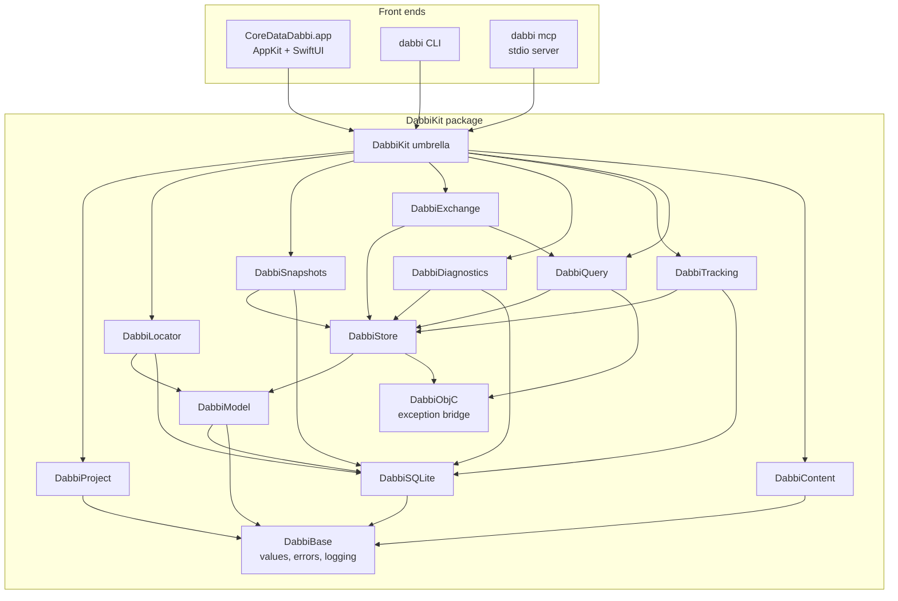

# CoreDataDabbi — Architecture

| | |
|---|---|
| **Status** | Draft v1.0 · 2026-09-20 |
| **Companion docs** | [PRD v1.1](PRD.md) · [Implementation plan](IMPLEMENTATION_PLAN.md) |
| **Scope** | The engine (`DabbiKit`), the macOS app, the `dabbi` CLI and the MCP server |
| **Validated on** | macOS 26.4.1 · Xcode 26.4.1 · Swift 6.3.1 (see Appendix A for spike results, Appendix B for what M0 added) |

This document says *how* the product in the PRD is built: module boundaries, the types that cross them, the concurrency model, the algorithms that carry the non-functional targets, and where the risky private-format knowledge is quarantined. The *when* is in the implementation plan.

---

## 1. Architectural drivers

| # | Driver (PRD ref) | Consequence for the design |
|---|---|---|
| D1 | Zero-instrumentation (§4 G1, TRK-3) | Everything is derived from files on disk plus Apple tooling (`simctl`, `devicectl`). Change tracking is file watching + diffing, never injected code. |
| D2 | Model-faithful (§4 G2) | **Core Data itself is the read/write path for object data** — it gives authoritative decoding, composites, external storage and validation for free. Raw SQLite is auxiliary (change detection, console, stats, raw mode). |
| D3 | Safe by default (§4 G3, §5) | Read-only open; write API gated by a capability token; staged edits; verified backup before first commit; short read transactions only. |
| D4 | Fast on big stores (§10) | ID-list + windowed paging, value-type rows, AppKit grid, no per-cell fetches, no `NSManagedObject` in the UI. |
| D5 | One engine, three front ends (§9.1) | UI-free package with a `Sendable` value-type API; the CLI exists from M0 as the engine's test harness. |
| D6 | Private on-disk details may change (§15) | All private-format knowledge lives in two modules (`DabbiSQLite` users: `SchemaMap`, `HistoryReader`) behind a capability probe, each with a Core-Data-only fallback. |
| D7 | Untrusted input (§9.8, §14) | Parse, never unarchive, attribute data; bounded decoders; hardened SQLite connection; locked-down web view. |
| D8 | Contributor-friendly (§4 G7, §14) | Protocol plug-points (decoders, exporters, Doctor checks); no secrets, no project generators; clone → open → run. |

---

## 2. Key decisions (ADR summary)

Each row becomes a short ADR file under `docs/adr/` when the repo is bootstrapped. "Assumed" = adopts the PRD's proposed answer to an open question (§16); revisit if the owner decides otherwise.

| ID | Decision | Why | Status |
|---|---|---|---|
| ADR-01 | **Hybrid data path**: Core Data for object values and all writes; raw SQLite only for change detection, SQL console, stats, history fallback, raw mode. | D2 + D6: minimises the private-format surface to table names, `Z_PK/Z_ENT/Z_OPT`, join tables. | Accepted |
| ADR-02 | **Engine API is `Sendable` value types.** `NSManagedObject`, contexts and coordinators never cross `StoreSession`'s public API. | Swift 6 strict concurrency; same API serves GUI, CLI, MCP; rows are cheap to cache and diff. | Accepted |
| ADR-03 | `StoreSession` and `ChangeTracker` are **actors**; Core Data work runs inside `await context.perform {}` and returns DTOs. | Data-race safety without `@unchecked Sendable` leakage. | Accepted |
| ADR-04 | One SwiftPM package, **multiple targets** with enforced layering, one umbrella product `DabbiKit`. Cross-target internals use the `package` access level. | Layering is compiler-checked; decoders can be fuzzed alone; public API stays small. | Accepted |
| ADR-05 | **AppKit lifecycle + `NSDocument`**; SwiftUI hosted (`NSHostingView`) for inspector forms, settings, wizards, welcome. Not `DocumentGroup`. | Tabs/versions/package documents, `NSTableView`, `NSPredicateEditor`, responder-chain menus all need AppKit control. | Accepted |
| ADR-06 | Committed `.xcodeproj` (folder-synchronised groups) that references the local package. No XcodeGen/Tuist. | Clone → open → run with zero extra tools. | Accepted |
| ADR-07 | System SQLite via `import SQLite3` and a thin in-house wrapper. No GRDB/SQLite.swift. | We need only prepared statements, authorizer, interrupt, backup API; PRD §14 wants few deps and the system library. | Accepted |
| ADR-08 | Own **binary-plist + keyed-archive parser**; `NSKeyedUnarchiver` is never run on attribute data. | `PropertyListSerialization` hides `CFKeyedArchiverUID` values behind private types; own parser is bounded, fuzzable, safe. | Accepted |
| ADR-09 | The sanitiser gives **every** transformable attribute the pass-through transformer — not only unknown names. | A `nil` transformer name means Core Data's default secure-unarchive transformer, which would instantiate classes from untrusted data. Spike: hashes unaffected. | Accepted |
| ADR-10 | Tracker strategy: **persistent-history-first**, `Z_PK/Z_OPT` scan fallback, join-table diff for to-many; changed rows materialised through Core Data. | Exact and cheap when history exists; universal otherwise. | Accepted |
| ADR-11 | The staging area for edits **is** the editable context's unsaved change set + its `UndoManager`. | No parallel change model to keep in sync; validation and pending-change display come from Core Data. | Accepted |
| ADR-12 | Writes require a `WriteAuthorization` value that only the app and `dabbi --allow-writes` can mint; the MCP target cannot construct one. | "Writes are never exposed over MCP" becomes a compile-time property. | Accepted |
| ADR-13 | `.dabbi` is a JSON **package**, schema-versioned, with machine-local state (bookmarks, window state) separable from shareable state. | Diffable, committable, team-friendly (PRD §9.6, open question 4). | Accepted |
| ADR-14 | macOS 14 minimum, Swift 6 language mode, MIT licence, Observation framework for view models. | PRD proposals (§16 Q1, Q2). macOS 14 is needed for composites and gives `@Observable`. | Assumed |
| ADR-15 | Diagram auto-layout and text exporters (SVG, Mermaid, DOT) live in the engine; PDF/PNG rendering in the app. | CLI can emit diagrams; layout is unit-testable. | Accepted |
| ADR-16 | The CLI target is created in M0 (`describe`, `query`) and hardened into the product CLI in M6. | Headless exit criterion for M0; agents and CI use it from day one. | Accepted |

---

## 3. System overview

### 3.1 Components



Layering rule: arrows only point down. `DabbiContent` and `DabbiProject` depend on nothing but `DabbiBase`, so they can be built, tested and fuzzed in isolation. No engine target imports AppKit or SwiftUI (CI greps for it).

### 3.2 Repository layout

```
CoreDataDabbi/
├─ Package.swift                  DabbiKit targets, dabbi executable, tools
├─ Sources/
│   ├─ DabbiBase/  DabbiObjC/  DabbiSQLite/  DabbiModel/  DabbiStore/
│   ├─ DabbiQuery/ DabbiTracking/ DabbiLocator/ DabbiContent/
│   ├─ DabbiExchange/ DabbiSnapshots/ DabbiDiagnostics/ DabbiProject/
│   ├─ DabbiKit/                  umbrella: @_exported imports + DocC catalog
│   └─ dabbi/                     CLI (swift-argument-parser) incl. `mcp` subcommand
├─ Tests/                         one test target per engine target
├─ App/
│   ├─ CoreDataDabbi.xcodeproj    references ../Package.swift
│   ├─ CoreDataDabbi/             app sources, Info.plist, assets, String Catalogs
│   ├─ CoreDataDabbiUITests/
│   └─ Config/                    Base.xcconfig, `#include? "Local.xcconfig"` for signing
├─ Tools/
│   ├─ FixtureGen/                executable: generates the fixture zoo
│   └─ Writer/                    scripted writer: macOS CLI + iOS simulator app
├─ Fixtures/                      generated output (git-ignored)
├─ Scripts/                       fixtures.sh, release.sh, notarize.sh, appcast.sh
├─ docs/                          PRD, this file, plan, adr/, DocC site sources
└─ .github/                       workflows, issue/PR templates, labels.yml
```

### 3.3 PRD component ↔ target mapping

Targets are prefixed (`Dabbi…`) because SwiftPM module names must be unique across a consumer's whole dependency graph; generic names like `Snapshots` would collide.

| PRD §9.1 name | Target | Notes |
|---|---|---|
| StoreLocator | `DabbiLocator` | |
| ModelLoader | `DabbiModel` | also owns `SchemaMap`, `ModelDescription`, model diff |
| StoreSession | `DabbiStore` | paging, values, staged edits, backups trigger |
| RawSQLite | `DabbiSQLite` | connection wrapper only; *users* of it hold the private-format knowledge |
| ChangeTracker | `DabbiTracking` | includes `HistoryReader` |
| QueryEngine | `DabbiQuery` | predicates, templates, global search, code generation |
| ImportExport | `DabbiExchange` | |
| Snapshots | `DabbiSnapshots` | backup-API copy, restore, store diff |
| ContentDecoders | `DabbiContent` | |
| — (new) | `DabbiBase`, `DabbiObjC`, `DabbiProject`, `DabbiDiagnostics` | shared values/errors · ObjC exception bridge · `.dabbi` format · stats + Doctor + diagram layout |

---

## 4. Engine boundary types (`DabbiBase`)

Everything a front end sees is a `Sendable`, `Codable` value. These types are the stable API contract of `DabbiKit` (semver'd; `0.x` until app 1.0; experimental API behind `@_spi(Unstable)`).

```swift
public struct ObjectRef: Sendable, Hashable, Codable {       // identity of one managed object
    public let entity: String
    public let pk: Int64                                      // Z_PK, from the URI's last component ("p42")
    public let uri: URL                                       // x-coredata://<store-uuid>/<Entity>/p42
}

public enum Value: Sendable, Hashable, Codable {
    case null                                                 // rendered distinctly from "" (BRW-4)
    case bool(Bool), int(Int64), double(Double), decimal(Decimal), string(String)
    case date(Date)                                           // raw TimeInterval derivable for hover
    case uuid(UUID), url(URL)
    case blob(BlobSummary)                                    // binary + transformable: never inlined in pages
    case composite([String: Value])
    case toOne(ObjectRef?, display: String?)
    case toMany(count: Int)
}

public struct BlobSummary: Sendable, Hashable, Codable {
    public let byteCount: Int
    public let sniffedType: ContentTypeID?                    // from the first 64 bytes only
    public let isExternal: Bool                               // "Allows External Storage"
}

public struct RowSnapshot: Sendable { public let ref: ObjectRef; public let values: [Value] }   // order = ColumnSet
public struct RowPage:     Sendable { public let range: Range<Int>; public let rows: [RowSnapshot]; public let generation: Int }

public struct FetchSpec: Sendable, Hashable, Codable {
    public var entity: String
    public var includeSubentities = true                      // BRW-6
    public var predicate: PredicateSource?                    // format string + parsed AST
    public var sort: [SortKey] = []                           // empty = object-ID order (BRW-11)
    public var limit: Int?
}
```

`ModelDescription` is a complete value-type mirror of `NSManagedObjectModel` (entities, inheritance, attributes with all validation facets, relationships, indexes, uniqueness constraints, user info, renaming IDs, version hashes, fetch-request templates). It feeds the sidebar, the entity inspector, predicate autocomplete, diagrams, model diff, `dabbi describe` and the MCP `describe_model` tool from one source.

`DabbiError` carries a machine code, a plain-language message, a *diagnosis* (what we looked for, where) and *recovery suggestions* — the PRD's "instructive empty/error states" (§8.1) are rendered straight from it.

---

## 5. Concurrency and lifecycle

- Swift 6 language mode, complete strict-concurrency checking, in every target.
- **`StoreSession` (actor)** owns one `NSPersistentStoreCoordinator` and its contexts. Public methods are `async`, do their Core Data work inside `try await context.perform { … }`, convert to DTOs *inside* the closure, and return only DTOs.
- Contexts, all private-queue, `stalenessInterval = 0`, fetches with `shouldRefreshRefetchedObjects = true`:

  | Context | Exists when | Used for |
  |---|---|---|
  | `browse` | always | pages, counts, relationship lookups, blob loads |
  | `track` | tracking active | materialising changed rows without disturbing `browse` |
  | `edit` | access mode = Editable | staged edits with `UndoManager`; in Editable mode browsing also goes through it so pending values show in the grid |

- **Generations.** Anything that invalidates row positions (mode switch, commit, refetch, auto-repair re-open) bumps `session.generation`. Pagers and pages carry the generation; stale pages are dropped by the UI.
- **Access-mode switch** (EDT-1) = tear down the coordinator and rebuild it with different store options. It is not a flag flip, because `NSReadOnlyPersistentStoreOption` is an open-time option.
- **UI** view models are `@MainActor @Observable`. AppKit data sources read synchronously from a main-actor page cache and request misses asynchronously.
- **Streams.** Long-running producers (store search, global search, tracking, import progress) return `AsyncThrowingStream`; cancellation is task cancellation. SQLite work is interrupted via `sqlite3_interrupt` from the cancellation handler.
- **Subprocesses** (`xcrun …`) go through one `ProcessRunner` protocol: JSON output modes only, timeouts, test doubles.

---

## 6. Engine modules

### 6.1 `DabbiObjC` — exception bridge

One Objective-C function, `DBTryCatch(block, &error)`, that converts `NSException` into `NSError`. Required because `NSPredicate(format:)`, fetch execution with bad key paths, KVC on unknown keys and `predicate.evaluate(with:)` raise ObjC exceptions that Swift cannot catch (PRD §7.1). Rule: keep the guarded block tiny (one Foundation/Core Data call) — unwinding through Swift frames is not memory-safe in general.

### 6.2 `DabbiSQLite` — the raw connection

- `SQLiteConnection`: non-`Sendable` final class, always confined to an actor (`SQLiteReader`).
- Opened `SQLITE_OPEN_READONLY`, then `PRAGMA query_only = 1`, `PRAGMA trusted_schema = OFF`, `SQLITE_DBCONFIG_DEFENSIVE`, small busy timeout (250 ms), statement/row limits via `sqlite3_limit`.
- **Short read transactions only.** A reader that keeps a transaction open pins the WAL and stops the inspected app's checkpoints from completing. No transaction is ever held across an `await`.
- **Authorizer** (`sqlite3_set_authorizer`) allow-lists `SELECT`/`READ`/`FUNCTION` for the SQL console; denies `ATTACH`, write pragmas, and everything else — defence in depth on top of the read-only handle.
- Progress handler + `sqlite3_interrupt` for cancellation and runaway-query timeouts.
- Backup API wrapper (`sqlite3_backup_*`) used by `DabbiSnapshots`.
- Header sniff: not `SQLite format 3\0` → *encrypted or not SQLite* error (SQLCipher message, PRD §9.3). No `Z_METADATA` → offer raw mode (PRJ-13).
- **Read-only WAL caveat** (verified in M0 — Appendix B): a WAL-mode database whose `-shm` is missing cannot be opened read-only at all — not by the system SQLite, not by Core Data with `NSReadOnlyPersistentStoreOption` (error 256) — *even when the directory is writable*, because a read-only connection never creates the `-shm`. `immutable=1` is no way out: Core Data cannot be handed URI parameters. A rollback-journal database has no such needs and opens read-only anywhere, including a read-only folder. Two consequences:
  - `SQLiteBackup` switches its destination to `journal_mode = DELETE`, so every snapshot and working copy is one self-contained file. Core Data puts a store back into WAL mode by itself the next time it opens it read-write.
  - For stores that cannot be opened in place (a copied store without its `-shm`, mounted images, locked-down `.xcappdata`), the locator file-copies `store`, `-wal`, `-shm` (when present) and the external-data folder into a working directory, opens **the copy** read-write once — it is ours — so that SQLite replays the WAL, switches it to a rollback journal, and from then on treats it like any other store; the project records that it is looking at a copy. Until that flow exists (M1) the open fails with an error that names the missing `-shm` and says how to get it back.

### 6.3 `DabbiModel` — models without the app's code

**Resolution pipeline** (PRJ-3/4/5/7/11), first success wins, result labelled with its `ModelSource`:

1. User-selected `.mom`/`.momd`.
2. App bundle scan: every `.mom` inside every `.momd` (not only the current version — the store may be on an older one), plus loose `.mom`s, in the app, `Frameworks/` and `PlugIns/`. Match the store's `NSStoreModelVersionHashes` against a single model first, then against **merged** models (apps commonly use `mergedModel(from:)`, so the store's hash set can be the union of several files).
3. Store-cached model: `SELECT Z_CONTENT FROM Z_MODELCACHE`.
   - Probe the first bytes: `bplist00` → use as is; otherwise inflate as **raw DEFLATE** (verified: this is what current OS versions write — Appendix A), then fall back through LZFSE/LZ4/LZMA. Inflate is capped (64 MB) against decompression bombs.
   - `NSKeyedUnarchiver.unarchivedObject(ofClass: NSManagedObjectModel.self, from:)` with secure coding.
   - *This is the single sanctioned use of an unarchiver on file content.* It is restricted to Core Data's own model classes. Follow-up hardening (post-1.0): do it in an XPC helper.

**Sanitiser** — applied to a mutable copy before any coordinator sees it:

- every entity's `managedObjectClassName` → `NSManagedObject`;
- **every** transformable attribute's `valueTransformerName` → `DabbiPassThroughTransformer` (returns the stored `Data` untouched; ADR-09); the original name is kept in `ModelDescription` for display;
- nothing else is touched; after sanitising we assert `entityVersionHashesByName` is unchanged and fail loudly otherwise (spike confirms it is).

**Compatibility**: `isConfiguration(withName:compatibleWithStoreMetadata:)`; on failure compute the per-entity hash diff (store-only / model-only / hash-differs) for the mismatch UI (PRJ-7).

**`SchemaMap`** — the quarantine for private naming knowledge:

- Built by convention, then **verified against `sqlite_master` and `PRAGMA table_info`**; every mapping carries `verified: Bool`. Unverified mappings are never used for anything but display.
- Conventions observed (Appendix A): root entity → table `Z<ROOT>` shared by all sub-entities with discriminator `Z_ENT`; entity numbers from `Z_PRIMARYKEY`; attribute → `Z<NAME>`; to-one → `Z<REL>` plus `Z<n>_<REL>` when the destination has sub-entities; many-to-many → `Z_<n><REL>` with columns `Z_<n><INVERSE>`, `Z_<m><REL>`; ordered → `Z_FOK_<REL>`; history → `ATRANSACTION`/`ACHANGE`/`ATRANSACTIONSTRING`; CloudKit mirroring → `ANSCK*`.
- **`FormatProbe`** reports capabilities per store — `hasModelCache`, `hasHistory`, `hasCloudKitMirroring`, `hasZOpt`, `schemaMapVerified` — and every feature that needs private details checks the probe and degrades with an explanation instead of failing.

Also here: **model diff** (two `ModelDescription`s → added/removed/changed entities, attributes, relationships, hash changes) and the **migration check** (`NSMappingModel.inferredMappingModel` in a guarded block, error translated) for §7.6.

### 6.4 `DabbiStore` — the Core Data stack

**Open options**

| Mode | Store options | Notes |
|---|---|---|
| Read-only (default) | `NSReadOnlyPersistentStoreOption`; no migration options; never infer mapping | Works on history-tracked stores without the history key (verified). |
| Editable | none of the above; `NSPersistentHistoryTrackingKey = true` **iff** `probe.hasHistory` | Never turn history on for a store that lacks it (EDT-5). Transaction author `CoreDataDabbi`. |

**Paging — how 1M rows scroll at 60 fps (BRW-11, §10)**

1. `openPager(spec)` runs one fetch with `resultType = .managedObjectIDResultType`, the spec's predicate and sort. SQLite-store object IDs are tagged pointers, so 1M IDs ≈ 8 MB. Every request ends with a `self` ascending sort descriptor: it is the rowid, so alone it costs nothing, it makes the unsorted order stable (SQLite would otherwise walk whichever index covers the query) and it breaks ties under the user's sort keys. Primary keys are handed out at save time and do **not** follow insertion order, so “unsorted” means primary-key order, not creation order. Sorting an unindexed column on 1M rows is a one-off sub-second wait with a progress indicator.
2. `page(handle, range, columns)` fetches `self IN ids[range]` with `returnsObjectsAsFaults = false`, `propertiesToFetch` limited to visible columns when *lazy loading* is on, to-one display targets via `relationshipKeyPathsForPrefetching`; rows are re-ordered to ID order and converted to `[Value]`.
3. To-many counts are computed per page, never per cell. A one-to-many relationship takes one grouped dictionary fetch on the destination (`inverse IN page`, grouped by the inverse, `count:` of the *evaluated object* — counting the inverse itself fails when its destination has sub-entities, because that to-one is two columns). It is public API only and needs no `SchemaMap`. Many-to-many relationships, relationships without an inverse, and any batch that fails fall back to a per-row Core Data count: slower, never wrong.
4. Blobs are summarised (size, sniffed type from a bounded prefix), and loaded in full only by `blob(for:attribute:)` when the content viewer asks.
5. Page size 200, LRU of ~50 pages, prefetch ±2 pages around the visible range. Pages are dropped on generation change.

**To-one display value** (BRW-2): first of `name`, `title`, `label`, `identifier`, then first string attribute, else `Entity #pk`; overridable per entity in the project.

**Staged edits (EDT-8)** — ADR-11:

- Edits mutate objects in the `edit` context. *Pending Changes* = `insertedObjects` / `updatedObjects` (with `changedValues()` vs `committedValues(forKeys:)`) / `deletedObjects`, exposed as `[PendingChange]`.
- Undo/redo = the context's `UndoManager`, bridged to the window's undo manager.
- After every staged edit the touched objects run `validateForInsert/Update/Delete`; `NSError`s (incl. `NSDetailedErrorsKey`) are mapped by `ValidationTranslator` to per-field, plain-language `ValidationIssue`s (EDT-2).
- **Commit pipeline:** mint-check `WriteAuthorization` → guards (CloudKit EDT-11, live process EDT-10) → if first commit this session: backup via `DabbiSnapshots`, then *verify* it (`integrity_check` + row-count spot check) → `save()` → on optimistic-lock conflict (the app changed the same row) show mine/theirs per object; merge policy is `NSErrorMergePolicy` so nothing is silently overwritten → bump generation.
- Core Data takes the SQLite write lock only during `save()`; nothing holds it while idle (§5 "never surprise the running app").

**Live-process guard**: `proc_listpidspath` (libproc) lists PIDs that have the store file open — precise, cheap, and works for simulator apps because they are host processes. Offers `simctl terminate <udid> <bundle-id>`.

### 6.5 `DabbiQuery` — predicates and search

- **One source of truth: `PredicateAST`** (Codable). Text → `NSPredicate(format:argumentArray:)` inside the exception bridge → walk `NSCompoundPredicate`/`NSComparisonPredicate`/`NSExpression` → AST. Builder edits produce AST directly. AST → `NSPredicate` for execution.
- **Validation before execution:** every key path in the AST is resolved against `ModelDescription` (through relationships, composite elements, `@count`, quantifiers). Unknown paths become diagnostics, not exceptions — this is also PRD-5 (saved predicates vs a changed model → warning badge + missing key paths).
- **Round-trip (§7.1):** `isBuilderRepresentable(ast)` decides whether the visual builder can show it; otherwise the builder shows a single read-only "custom expression" row and the text field stays authoritative.
- **Autocomplete:** tokenise up to the caret, resolve the partial key path in the model, offer attributes/relationships/operators/`[cd]` options.
- **Code generation (PRD-4):** AST → format string · Swift `NSPredicate` · Objective-C · `#Predicate` (subset; unsupported operators are reported, not silently dropped) · full `NSFetchRequest`/`FetchDescriptor` with sorts.
- **Fetch templates:** `fetchRequestFromTemplate(withName:substitutionVariables:)`, variables discovered from the AST and prompted with type-appropriate editors.
- **Quick filter (PRD-6):** OR of `CONTAINS[cd]` over the entity's string attributes. **Global search (§7.9):** per-entity predicates chosen by the term's type (string/number/UUID), bounded parallelism, streamed results.
- **In-memory evaluation** for tracking predicate views (TRK-7): `predicate.evaluate(with: managedObject)` in the `track` context, guarded.

### 6.6 `DabbiTracking` — change tracker

```
FS events ──▶ debounce 150 ms ──▶ PRAGMA data_version changed? ──no──▶ done
                                          │yes
                         ┌────────────────┴─────────────────┐
                 history available?                     otherwise
        read transactions after last token        one read txn: SELECT Z_PK,Z_ENT,Z_OPT per
        (exact PKs, change type, columns,          tracked table + tracked join tables;
         author, context, txn id)                  merge-walk against previous maps
                         └────────────────┬─────────────────┘
                    inserted / updated / deleted PKs (+ link adds/removes)
                                          │
              materialise via Core Data `track` context (batches of 500, refreshed)
                                          │
        field diff vs cached prior snapshot ─▶ predicate enter/leave ─▶ ChangeBatch ─▶ VersionLog ─▶ UI
```

- **Watcher:** `DispatchSource` on `store`, `-wal`, `-shm` + FSEvents on the directory (files are recreated on checkpoint and reinstall; re-arm sources when that happens).
- **Cheap no-op filter:** one long-lived read-only connection (no open transaction) polls `PRAGMA data_version`, which changes only when another connection commits.
- **Scan strategy:** per *table* (sub-entities share it; partition by `Z_ENT`), `Z_PK/Z_OPT` kept as a sorted contiguous array — ~12 MB per million rows — and diffed by merge-walk. All tracked tables are read in **one** short transaction so the cross-entity picture is consistent. `Z_OPT` semantics verified (Appendix A).
- **History strategy:** `HistoryReader` protocol with two implementations — `CoreDataHistoryReader` (`NSPersistentHistoryChangeRequest`, preferred if it works on a read-only store; spike S7) and `RawHistoryReader` (history tables). It also feeds TRK-10 enrichment and the §7.4 timeline.
- **Prior values.** A field-level diff needs the previous snapshot. At start, entities up to a threshold (default 50k rows, configurable) are primed into the cache; larger entities prime only rows already paged in. An update to a never-seen row is shown as *changed — prior value unknown*, unless history supplies the changed property names (then those are highlighted without old values). Optional **deep tracking** takes a store snapshot at start and reads prior values from it on demand.
- **`VersionLog`:** append-only; in memory up to the cap (default 10k version rows), older entries spill to a temp SQLite file; exportable (TRK-5).
- **Latency budget** (< 500 ms): 150 ms debounce + < 1 ms data_version + 10–100 ms scan + materialise + one main-actor hop.
- **Fallback** when `SchemaMap` is unverified for a table: periodic Core Data refetch with row hashing, capped row count, clearly labelled *reduced-fidelity tracking*.

```swift
public actor ChangeTracker {
    public func start(_ scope: TrackingScope) -> AsyncStream<ChangeBatch>     // .entities([…], predicate:) | .allEntities
    public func pause(); public func resume(); public func stop()
}
public struct ChangeEvent: Sendable {
    public let object: ObjectRef
    public let kind: Kind                                  // .inserted .updated .deleted
    public let before: RowSnapshot?, after: RowSnapshot?
    public let changedKeys: Set<String>?                   // nil = unknown
    public let links: [LinkChange]                         // to-many adds/removes (TRK-9)
    public let transition: PredicateTransition?            // .entered / .left (TRK-7)
    public let history: HistoryInfo?                       // author, context, transaction id (TRK-10)
}
```

### 6.7 `DabbiLocator` — finding stores

- **`StoreLocation`** (persisted in projects; PRJ-2): `.simulator(udid, bundleID, container: .data | .group(id), relativePath)` · `.macApp(bundleID, relativePath)` · `.file(bookmark, lastKnownPath)` · `.container(xcappdataBookmark, relativePath)` · `.devicePull(deviceID, bundleID, relativePath)`. Simulator locations are re-resolved from identity, which is what makes auto-repair (PRJ-12) survive container UUID churn.
- **`SimulatorIndex`:** `simctl list -j devices`, fallback to `device.plist` parsing; bundle ID ↔ container mapping via `.com.apple.mobile_container_manager.metadata.plist` under `data/Containers/{Bundle,Data,Shared}`; store sniffing = SQLite header + `Z_METADATA` presence; per-device cache refreshed by FSEvents (target: first scan < 3 s for 30 devices — scan devices concurrently, sniff lazily).
- **SwiftData detection (PRJ-11):** no bundled `.mom` + conventional `default.store` in `Library/Application Support/` or group containers; group IDs from the app's entitlements (extraction method for simulator builds is spike S4).
- **Store search (PRJ-4/5/6/15):** streaming directory walk with exclusions and configurable extensions (incl. extension-less), hash match against candidate models, own-container fast path first.
- **Devices (§7.5):** `devicectl` with `--json-output`; feature hidden when unavailable.
- **TCC:** on macOS 14+ reading another app's `~/Library/Containers` data triggers a system consent prompt (and Group Containers on 15+). `EPERM` is turned into an explanatory error with a re-try; simulator paths are unaffected.

### 6.8 `DabbiContent` — field content decoding

```swift
public protocol ContentDecoder: Sendable {
    static var id: ContentTypeID { get }
    func probe(_ head: ByteView, hint: ContentHint) -> Confidence?      // magic bytes, attribute type, name hint
    func decode(_ data: Data, limits: DecodeLimits) throws -> DecodedContent
}
public enum DecodedContent: Sendable {
    case text(String, syntax: Syntax?)      // JSON / XML / HTML source, pretty-printed
    case tree(ContentNode)                  // JSON, plist, keyed archive → foldable tree
    case image(Data), pdf(Data), media(Data, UTType), web(html: String), rtf(Data)
    case wrapped(by: ContentTypeID, inner: Data)     // gzip / zlib: re-enter the pipeline
    case opaque                             // hex + strings view
}
```

- Registry ordered by confidence; `wrapped` re-enters detection (depth ≤ 3, inflated size capped).
- **Keyed-archive tree (CNT-4):** own `bplist00` reader → resolve `$top`/`$objects` UIDs → cycle-safe `ContentNode` tree labelled with `$classname`; friendly summaries for common classes (`NSAttributedString`, `NSColor`/`UIColor`, `NSDate`, `NSURL`, `NSUUID`, collections). No class is ever instantiated.
- Every decoder is one file + one fixture — the designed "first PR" surface (§14). A libFuzzer target covers the registry.

### 6.9 `DabbiExchange`, `DabbiSnapshots`, `DabbiDiagnostics`, `DabbiProject`

- **Exchange:** `Exporter`/`Importer` protocols; CSV (RFC 4180, separator option) and JSON (ISO 8601 dates, Base64 binary, depth-limited cycle-safe relationships, composites). Import = parse → map → coerce → **dry run in a scratch child context** → per-row report → apply to the `edit` context (so it is staged, validated and undoable like any other edit). Link-by-key and upsert use uniqueness constraints or object URIs (IMX-4).
- **Snapshots:** backup API copy from a read-only connection + external-data folder (`.<store>_SUPPORT/_EXTERNAL_DATA`), manifest with name/note/model hashes. The same code performs the pre-commit backup (EDT-9). **Restore:** live-process guard → remove `-wal`/`-shm` → atomic replace → re-open. **Diff:** compatible-model check → per-entity PK sets and `Z_OPT`/row hashes through two raw connections → materialise differing rows through Core Data for field-level output.
- **Diagnostics:** `StatisticsProvider` (`dbstat`, WAL/external sizes, null ratios) and `DoctorCheck` protocol (`integrity_check`, validation sweep, dangling FKs, inverse mismatches, orphaned external files, uniqueness duplicates, `Z_MAX` drift), each finding carrying `ObjectRef`s. Also `DiagramLayout` + SVG/Mermaid/DOT emitters (ADR-15).
- **Project format:**

  ```
  MyApp.dabbi/
  ├─ project.json        schemaVersion, storeLocation, modelReference, accessMode, display prefs
  ├─ predicates/*.json   name, FetchSpec (format string + AST), column layout
  ├─ diagrams/*.json     positions, hidden entities, style
  ├─ sql/*.sql           console snippets
  ├─ snapshots/index.json (+ optional payloads)
  └─ local/              bookmarks, window + selection state   ← machine-specific
  ```
  `local/` can be redirected to `~/Library/Application Support/CoreDataDabbi/Local/<project-uuid>/` so the package is shareable in a repo. Forward migrations keyed on `schemaVersion`; unknown keys are preserved on save.

---

## 7. Key flows

**Open a store.** Resolve `StoreLocation` → URL (auto-repair if needed) → header sniff → `FormatProbe` → model resolution pipeline → sanitise → compatibility check → read-only coordinator → `ModelDescription` + entity counts → sidebar. Budget < 1 s for 100 MB: counts run concurrently and lazily; first page is fetched in object-ID order.

**Browse.** Sidebar selection → `FetchSpec` → `openPager` → grid asks for visible pages → placeholders fill in. Selection → inspector (`object(ref)`), relationships panel (pager over the related set), content viewer (`blob` → decoder pipeline). Every navigation pushes a `BrowseLocation` on the window's history (REL-3).

**Track.** ⌘R → tracker starts for the current scope → grid swaps to the tracking-log data source → batches append version rows; sidebar badges update from the same stream (TRK-8).

**Edit and commit.** Unlock → session rebuilds as Editable → edits stage in the `edit` context → *Pending Changes* panel → ⌘↩ runs the commit pipeline (§6.4).

**Snapshot and restore.** Snapshot = backup-API copy + manifest. Restore = guard the app is not running (offer terminate) → replace files → re-open → bump generation.

---

## 8. App architecture

```
AppDelegate ─ NSDocumentController
  └─ ProjectDocument : NSDocument            reads/writes the .dabbi package (FileWrapper), autosave + Versions
       └─ ProjectContext  (@MainActor)       per-document composition root
            ├─ project: Project              Codable model from DabbiProject
            ├─ session: StoreSession?   tracker: ChangeTracker?
            ├─ navigation: NavigationHistory   (back/forward, breadcrumb)
            └─ view models: Sidebar · Grid · Inspector · Relationships · Content · PendingChanges · Status
  └─ ProjectWindowController ─ NSSplitViewController tree (all panes collapsible, layout saved per project)
       ├─ SidebarViewController        NSOutlineView + filter field
       ├─ center: PredicateBar (NSPredicateEditor + text field) / GridViewController (NSTableView)
       │          bottom: RelationshipsViewController | ContentViewController
       └─ InspectorViewController      SwiftUI (Details · Entity · Structure)
```

- **Grid:** view-based `NSTableView`, fixed row height, columns generated from `ModelDescription` + saved layout; two interchangeable data sources (`PagedRowsDataSource`, `TrackingLogDataSource`); cell views reused and configured from `Value` only. Column state persists per entity and per saved predicate (BRW-3).
- **Predicate bar:** `NSPredicateEditor` with row templates generated from the model (key-path depth-limited), plus the text field; both bind to the same `PredicateAST`.
- **Commands:** menu items target the responder chain; `ProjectWindowController` validates them (`NSUserInterfaceValidations`) from `ProjectContext` state (locked, tracking, selection).
- **Content viewer:** native views per `DecodedContent` case; HTML in a `WKWebView` with a non-persistent data store, a content rule list that blocks all remote loads unless the project allows them (CNT-3), and JavaScript confined to the previewed document.
- **Diagram canvas:** layer-backed `NSView`; positions stored in the project; layout from `DiagramLayout`.
- **Accessibility:** tracking state is part of each row's accessibility label and has a glyph column; colours come from a palette checked for AA contrast in both appearances; Reduce Motion disables row flash animations.
- **Integration points:** URL scheme handler → `NSDocumentController`; Sparkle (release builds only); "Report a Problem…" builds a GitHub issue URL from the local crash log and environment — never row data.

---

## 9. CLI and MCP server

- `dabbi` uses swift-argument-parser. Commands map 1:1 onto engine calls: `stores`, `describe`, `query`, `export`, `snapshot`, `restore`, `diff`, `open`, `mcp`. Output: human tables by default, `--json` everywhere. Write-capable commands refuse to run without `--allow-writes`.
- `dabbi mcp` speaks MCP over stdio via the MCP Swift SDK. Tools: `list_stores`, `describe_model`, `fetch` (entity, predicate, sort, limit), `get_object`, `recent_changes`. Row and byte caps on every result; blobs are returned as summaries unless explicitly requested by reference.
- ADR-12 in practice: `WriteAuthorization` has a `package`-level initialiser wrapped by two public factories that live in code the MCP command does not link against; a test asserts the MCP tool list contains no mutating tool.

---

## 10. Cross-cutting concerns

| Concern | Approach |
|---|---|
| **Security** | Threat: a hostile store file. SQLite hardening (§6.2); model unarchive restricted to Core Data classes (§6.3); attribute data parsed only (§6.8); inflate and recursion caps; web view lockdown (§8); hardened runtime; no network use except opt-in remote content and update checks. `SECURITY.md` with private reporting. |
| **Privacy** | No telemetry. `os.Logger` with categories per module; row values are never logged (enforced by a `Redacted` wrapper type for anything derived from store content). |
| **Errors** | `DabbiError` everywhere at the API boundary; ObjC exceptions converted at the bridge; UI renders diagnosis + recovery. |
| **Performance** | Budgets from PRD §10 are encoded as XCTest `measure` baselines on the 1M-row fixture; signposts (`OSSignposter`) around open, page fetch, tracker cycle. |
| **Settings** | `UserDefaults`-backed `AppSettings` (@Observable) in the app; the engine takes plain option structs — it never reads defaults. |
| **Localisation** | String Catalogs; engine errors carry keys + arguments, not formatted English. |
| **Dependencies** | Sparkle (app), swift-argument-parser (CLI), MCP Swift SDK (CLI). All permissive; licences re-checked at adoption time. |

---

## 11. Testing architecture

- **FixtureGen** (executable) builds the zoo from programmatic models — no binaries in git: all attribute types, inheritance, ordered / many-to-many / non-inverse relationships, composites, derived attributes, external storage, history tracking, CloudKit-mirrored schema, SwiftData (enums, Codable structs), 1M rows, WAL-only changes, old model caches. Output is cached in CI keyed by generator hash + OS version.
- **Writer** (macOS CLI + iOS simulator app) mutates a store from a script with known expected change sets; the tracker's end-to-end test compares the `VersionLog` with the script.
- Tiers: unit tests per target · golden/snapshot tests for decoders, exporters, code generation, diagram emitters · integration tests over the zoo · fuzzing for `DabbiContent` and the bplist parser · soak test (tracker attached to a busy writer for hours: no locks, leaks, missed changes) · UI tests for the four critical flows (open from simulator, track, edit + commit, import/export round trip).
- **Format canaries:** the private-format assertions from Appendix A are permanent tests, run on each macOS/Xcode image CI offers, so an OS change that breaks an assumption fails loudly.

---

## 12. Build, CI and release

- PR CI (GitHub Actions, no signing; `.github/workflows/ci.yml`): `swift build --build-tests`, `swift test`, `Scripts/smoke.sh` (the CLI loads the whole fixture zoo — cached by OS build + generator hash), lint (`swift-format`, pinned to the Xcode the code was formatted with), layering check (no AppKit in engine targets), DCO check (`Scripts/check-dco.sh`). The gate runs on the newest macOS image; the same tests run on the older image as a non-gating **format-canary leg** (§11). The app build joins in M1, when the app target exists.
- Release workflow (tag): archive → Developer ID sign → notarise → staple → `.dmg` → Sparkle appcast (EdDSA-signed) → GitHub Release → Homebrew cask/formula bump PRs. Signing material only in CI secrets.
- Local builds: *Sign to Run Locally* by default; optional `Config/Local.xcconfig` (git-ignored) for a personal team. Sparkle and update checks are compiled out of Debug.

---

## 13. Risks and spikes

| ID | Question | Status |
|---|---|---|
| S1 | `Z_MODELCACHE` encoding; sanitiser keeps hashes; read-only open of a history store; `Z_OPT` semantics; tagged object IDs; cross-process freshness | **Done — all confirmed** (Appendix A) |
| S2 | SwiftData stores: is the cached model always present and loadable; how enums/Codable structs surface through KVC | Open (M0) |
| S3 | Composite attributes through KVC: read shape, sort/filter key paths, write shape | Open (M0) |
| S4 | Extracting entitlements (app-group IDs) from simulator-built apps | Open (M1) |
| S5 | `NSTableView` prototype: 1M rows, 30 columns, paged placeholders, 60 fps | Open (M0/M1) |
| S6 | TCC behaviour when reading other Mac apps' containers from a non-sandboxed app | Open (M1) |
| S7 | `NSPersistentHistoryChangeRequest` on a read-only store opened without the history key | Open (M2) |
| S8 | External-storage blob column encoding (inline vs file reference marker) | Open (M1) |
| S9 | Behaviour of Core Data read-only open on a non-writable directory with a live `-wal` | Open (M1) |

Risks beyond the PRD's table:

- **Scope vs bandwidth** remains the largest risk; the plan's critical path keeps a usable viewer + tracker reachable before anything else.
- **Prior-value gap in tracking on very large entities** (§6.6) is a deliberate trade-off; deep tracking closes it at the cost of a store copy.
- **`NSPredicateEditor` flexibility** for nested composites and quantifiers may be limiting; the text mode is the escape hatch, and the builder may later be replaced by a custom SwiftUI builder over the same AST without touching the engine.

---

## Appendix A — Spike S1 results (2026-09-20)

A throw-away writer/reader pair (programmatic model: `Person` ⟵ `Employee` inheritance, `Tag` many-to-many, self to-one, transformable with a custom transformer name, history tracking on) established:

| Assumption | Result |
|---|---|
| Cached model location/encoding | `Z_MODELCACHE.Z_CONTENT`; **raw DEFLATE** (first bytes `9d 57…`, not a zlib `78` header); `NSData.decompressed(using: .zlib)` → 3.9 KB keyed archive → `NSKeyedUnarchiver.unarchivedObject(ofClass: NSManagedObjectModel.self)` succeeds with secure coding. |
| Sanitising keeps hashes | Changing `managedObjectClassName` and `valueTransformerName` left `entityVersionHashesByName` **identical**; `isConfiguration(…compatibleWithStoreMetadata:)` → true. |
| Read-only open of a history-tracked store without the history key | Works; objects come back as plain `NSManagedObject`. |
| `Z_OPT` | 1 after insert, +1 per saved update (observed 1 → 3 → 4). |
| Object IDs | `_NSCoreDataTaggedObjectID`, tagged pointers — an ID list costs 8 bytes per row. |
| Cross-process freshness | A read-only reader process saw another process's committed update and insert on its next fetch. |
| Schema conventions | `ZPERSON` shared by `Person`/`Employee` with `Z_ENT`; `Z_PRIMARYKEY(Z_ENT, Z_NAME, Z_SUPER, Z_MAX)`; to-one `ZBOSS` + `Z1_BOSS`; join table `Z_1TAGS(Z_1PEOPLE, Z_3TAGS)`; history tables `ATRANSACTION`, `ACHANGE`, `ATRANSACTIONSTRING` registered in `Z_PRIMARYKEY` with entity numbers 16001+. |

These become the first *format canary* tests in M0.

---

## Appendix B — Verified in M0 (2026-09-20)

Established while building the fixture zoo and its tests. Everything in the first table is asserted by `FormatCanaryTests`, so an OS that changes it fails CI.

**On-disk format** (private; quarantined in `SchemaMap` / `FormatProbe`)

| Convention | Observed |
|---|---|
| Entity numbers | Alphabetical, with each hierarchy depth-first: `Department` 1, `Party` 2, `Organisation` 3, `Person` 4, `Employee` 5, `Manager` 6, `Tag` 7. |
| Tables | Sub-entities share the root entity's table, told apart by `Z_ENT`. Every table starts `Z_PK`, `Z_ENT`, `Z_OPT`. |
| To-one | `Z<REL>`, plus `Z<n>_<REL>` (the destination's entity number) **only** when the destination has sub-entities: `ZBOSS` + `Z4_BOSS` for `boss → Person`, plain `ZHEAD` for `head → Manager`. |
| Many-to-many | Join table `Z_4TAGS(Z_4PEOPLE, Z_7TAGS)`. Each column is `Z_<n><REL>`: the number of the entity its rows point to, and the relationship that points there. The table is named `Z_<n><REL>` after one of the two sides — in both fixtures the side whose entity sorts first. `SchemaMap` does not rely on which, and looks for both names. |
| Ordered to-many | One-to-many: `Z_FOK_<INVERSE>` on the destination table. Many-to-many: `Z_FOK_<n><REL>` in the join table. |
| Composites | Flattened to one column per leaf (`ZSTREET`, `ZCITY`, `ZLATITUDE`, `ZLONGITUDE`); no column for the composite itself. |
| Derived attributes | Ordinary columns, kept up to date by `Z_DA_*` triggers that Core Data installs on the source and destination tables. |
| Bookkeeping | `Z_PRIMARYKEY`, `Z_METADATA`, `Z_MODELCACHE`; history `ACHANGE`, `ATRANSACTION`, `ATRANSACTIONSTRING`; CloudKit mirroring `ANSCK*`. |

**Platform behaviour** (public API, but not documented anywhere we could cite)

| Subject | Observed |
|---|---|
| WAL without `-shm` | Cannot be opened read-only by SQLite or by Core Data, even in a writable directory (§6.2). A rollback-journal database opens read-only anywhere. |
| Primary keys | Assigned at save time, not in insertion order. |
| `count:` in a grouped fetch | Must count `expressionForEvaluatedObject()`; counting a to-one whose destination has sub-entities generates `COUNT()` over two columns and fails. |
| `$x.key` and `SUBQUERY(…).@count` | Foundation parses both as the function `valueForKeyPath:` on a `.variable` / `.subquery` operand, with one argument of the private expression type 10 (`NSKeyPathSpecifierExpression`). `PredicateGuard` allows exactly that shape; `FUNCTION(x, 'valueForKeyPath:', …)` on any other operand stays refused. |
| Unknown key path in a fetch | Raises an Objective-C exception (caught by `DBTryCatch`) *and* logs a `CoreData: error:` line to stderr that cannot be silenced. Validating key paths against the model before executing (M2) avoids both. |
| `Date.ISO8601FormatStyle` | `.time(includingFractionalSeconds:)` on a fresh style drops the date; use `init(includingFractionalSeconds:timeZone:)`. |
