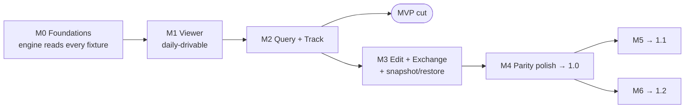

# CoreDataDabbi — Implementation Plan

| | |
|---|---|
| **Status** | Draft v1.0 · 2026-09-20 |
| **Companion docs** | [PRD v1.1](PRD.md) · [Architecture](ARCHITECTURE.md) |
| **Planning unit** | Work package (WP) = one GitHub issue/epic, labelled with its PRD IDs and milestone |

## 1. How to read this plan

- Milestones M0–M6 are the PRD's (§12). Each is split into work packages `Mx-nn` with tasks, the PRD IDs they satisfy, a size, and dependencies.
- **Sizes** are ideal engineering days for one experienced macOS developer: **S** ≤ 2 · **M** 3–5 · **L** 6–10 · **XL** 11–15. They are for ordering and scoping, not commitments; recalibrate after M0.
- Module and type names refer to the architecture document.
- Every WP ships with tests and, where it adds public `DabbiKit` API, DocC comments. Definition of done is in §11.

## 2. Deviations from the PRD that need the owner's nod

| # | Issue | Proposal in this plan |
|---|---|---|
| 1 | **§7.3 snapshots + restore are P0 ("required for 1.0") but the release plan puts them in M5 → 1.1.** | The pre-commit backup (EDT-9, M3) already needs the snapshot engine. Build snapshot + restore (engine + minimal UI) in **M3**; keep diff, shared library and scenarios in **M5**. If 1.0 must stay lean instead, re-label §7.3 snapshot/restore as P1. |
| 2 | TRK-10 (P1, needed for the M4 parity gate) depends on reading persistent history, which the PRD schedules in M5. | `HistoryReader` (engine) lands in **M2** because the tracker's history-first strategy needs it anyway; the timeline *UI* stays in M5. |
| 3 | PRD lists the sample writer app wholly in M0. | macOS writer CLI in M0 (enough for headless tracking tests); iOS-simulator writer target in M2 where the end-to-end tracking test needs it. |
| 4 | PRJ-16 welcome window is P0 but listed in M4. | Minimal welcome (recents, Open Database, Browse Simulators) in M1 so the viewer is drivable; drop zone + polish in M4. |
| 5 | The CLI is an M6 deliverable. | A two-command seed (`describe`, `query`) is created in M0 as the engine harness; productised in M6. |

Open questions from PRD §16 are taken at their proposed answers (MIT, macOS 14). Neither blocks M0.

## 3. Critical path

Within the path, the items that gate everything else: `ModelLoader` + sanitiser (M0-04) → `StoreSession` paging (M0-06, M1-04) → grid (M1-05) → tracker (M2-06…09). Content decoders, locator, diagrams, exchange and diagnostics are off the critical path and are the natural places for parallel contributors.

Rough duration for one full-time developer: **M0 5–7 wk · M1 9–12 · M2 9–12 · M3 10–13 · M4 10–14 · M5 7–9 · M6 8–10.** MVP (M0 + M1 + tracker half of M2) ≈ 20–26 weeks; 1.0 ≈ 43–58 weeks. Part-time or multi-contributor work scales accordingly.

## 4. Spikes (time-boxed, before the WP that depends on them)

| ID | Question | Box | Needed by | Status |
|---|---|---|---|---|
| S1 | Model-cache encoding, hash stability after sanitising, `Z_OPT`, tagged IDs, cross-process freshness | — | M0-04 | **Done**, all confirmed (Architecture App. A) |
| S2 | SwiftData stores: cached model always present? enum / Codable-struct shapes via KVC | 1 d | M0-07, M1-10 | Open |
| S3 | Composite attributes via KVC: read, key-path sort/filter, write | 1 d | M0-06 | Open |
| S5 | `NSTableView` with 1M paged rows × 30 columns at 60 fps | 2 d | M1-05 | Open |
| S4 | App-group entitlements from simulator-built apps | 1 d | M1-09 | Open |
| S6 | TCC prompts when reading other Mac apps' containers | 0.5 d | M1-08 | Open |
| S8 | External-storage blob column encoding | 0.5 d | M1-07 | Open |
| S9 | Read-only open on a non-writable directory with live `-wal` | 0.5 d | M1-08 | Open |
| S7 | `NSPersistentHistoryChangeRequest` on a read-only store | 1 d | M2-08 | Open |

Every spike ends as either a permanent *format canary* test or an ADR amendment.

---

## 5. M0 — Foundations

**Exit:** `dabbi describe` and `dabbi query` load every fixture headlessly; PR CI green on a clean clone.

| WP | Work package | Key tasks | PRD | Size | Deps |
|---|---|---|---|---|---|
| M0-01 | Repo bootstrap | `git init`; LICENSE (MIT + trademark carve-out), README (credits the reference product as inspiration), CONTRIBUTING (DCO, clean-room rule), CODE_OF_CONDUCT, SECURITY.md, issue/PR templates, `labels.yml` from PRD IDs, `.gitignore`, swift-format config, `docs/adr/` seeded from Architecture §2 | §14 | S | — |
| M0-02 | Package skeleton | `Package.swift` with all targets (empty where not yet needed), Swift 6 mode, strict concurrency; `DabbiBase` values + `DabbiError`; `DabbiObjC` exception bridge with tests | §9.1 | M | 01 |
| M0-03 | `DabbiSQLite` | connection/statement wrapper, read-only + `query_only` + defensive config, authorizer, interrupt/timeout, backup wrapper, header sniff | §9.3 | M | 02 |
| M0-04 | Model loading | `.mom`/`.momd` (all versions, merged-model matching), cached model (inflate probe + secure unarchive + size cap), sanitiser with hash-equality assertion, compatibility check + per-entity hash diff, `ModelDescription` | PRJ-3, §9.2 | L | 03 |
| M0-05 | `SchemaMap` + `FormatProbe` | convention builder, verification against `sqlite_master`/`table_info`, capability flags, format canary tests from S1 | §15 | M | 04 |
| M0-06 | Read-only `StoreSession` | open, counts, `openPager`/`page`, `object(ref)`, `blob(for:)`, `Value` conversion for every attribute type incl. composites, to-one display heuristic, generations | BRW-2/4/11 (engine) | L | 04, S3 |
| M0-07 | FixtureGen + zoo v1 | programmatic models for every case in PRD §11 except CloudKit/SwiftData/1M (added in 07b); `Scripts/fixtures.sh`; git-ignored output | §11 | L | 02 |
| M0-07b | Zoo v2 | SwiftData fixture, CloudKit-schema fixture, 1M-row fixture, old-cache fixture | §11 | M | 07, S2 |
| M0-08 | Writer (macOS CLI) | scripted mutations with expected change sets (JSON) | §11 | M | 07 |
| M0-09 | CI | Actions workflow: build, tests, fixture cache, lint, layering check, DCO check | §11 | S | 02 |
| M0-10 | CLI seed | `dabbi describe <store>` and `dabbi query <store> <Entity> [--where] [--json]` | ADR-16 | S | 06 |

---

## 6. M1 — Viewer

**Exit:** a daily-drivable read-only viewer: open a store file or pick one from the simulator browser, browse, follow relationships, inspect content. Opens a 100 MB store in < 1 s; the 1M-row fixture scrolls at 60 fps.

| WP | Work package | Key tasks | PRD | Size | Deps |
|---|---|---|---|---|---|
| M1-01 | App shell | Xcode project + xcconfigs, AppKit lifecycle, `ProjectDocument` (package `FileWrapper`, autosave, tabs, Versions), exported `.dabbi` UTI, `ProjectContext`, split-view skeleton with collapsible panes, toolbar, status capsule | PRJ-1, §8.1 | L | M0 |
| M1-02 | Project format v1 | `Project` Codable schema + `schemaVersion`, `StoreLocation`, bookmarks, `local/` separation, unknown-key preservation, round-trip tests | PRJ-1, PRJ-2, §9.6 | M | M0-02 |
| M1-03 | Sidebar | `NSOutlineView`: entity tree with inheritance and async counts, Fetch Requests (listed), filter field | BRW-1 | M | 01 |
| M1-04 | Pager hardening | page cache, prefetch, lazy-load option, fetch limit + "Load more", batched to-many counts, perf baselines on 1M fixture | BRW-11, §10 | M | M0-06 |
| M1-05 | Main grid | dynamic columns, type-aware cells (nil vs empty, dates with time zone + raw hover, blob summary + thumbnail, composites inline), object-ID column, click/shift-click sort, reorder/hide/Show All/auto-size persisted per entity, sub-entity "Entity" column | BRW-2, BRW-3, BRW-4, BRW-6 | XL | 04, S5 |
| M1-06 | Inspector | Details (read-only for now, tab-navigable), Entity description (all facets of BRW-8), Structure tab with table DDL | BRW-7, BRW-8 | L | 05 |
| M1-07 | Content decoders + panel | registry, sniffers, text/JSON/XML/HTML-source/RTF/plist/image/PDF/media, gzip/zlib re-detect, hex; own bplist parser; keyed-archive tree; Rendered/Text/Hex switcher with foldable tree; fuzz target | CNT-1, CNT-2, CNT-4 | XL | M0-02, S8 |
| M1-08 | Open Database flow | open panel, model-source label + cached-model warning, error states (encrypted, not Core Data, incompatible), read-only-location copy fallback | PRJ-3, §8.1 | M | 01, S6, S9 |
| M1-09 | Simulator index + browser | `ProcessRunner`, `simctl` JSON + `device.plist` fallback, container mapping incl. app groups, store sniffing, FSEvents refresh, browser UI (runtime groups, booted badge, icons, search, Booted-only), one click → project | PRJ-8, §9.5 | XL | 02, S4 |
| M1-10 | SwiftData detection | no-`.mom` detection, entitlements → group IDs, `default.store` conventions, cached model path | PRJ-11 | M | 09, S2 |
| M1-11 | Relationships panel + navigation | relationship list with counts, related grid (ordered index, many-to-many, non-inverse), selection feeds inspector/content; Reveal in Entity, back/forward, breadcrumb | REL-1, REL-2, REL-3 | L | 05 |
| M1-12 | Minimal welcome + recents | recents, Open Database, Browse Simulators | PRJ-16 (part) | S | 01 |
| M1-13 | A11y + keyboard baseline | VoiceOver labels for cells, full keyboard nav of panes, Dark Mode pass | §8.4 | M | 05 |

---

## 7. M2 — Query + Track

**Exit:** the tracking demo works against the iOS-simulator writer app, including on a read-only store and on a saved-predicate view; save → highlighted row in < 500 ms.

| WP | Work package | Key tasks | PRD | Size | Deps |
|---|---|---|---|---|---|
| M2-01 | Predicate core | `PredicateAST`, guarded text parse, `NSPredicate` ↔ AST, key-path validation with diagnostics, builder-representability check | §7.1, PRD-2, PRD-5 | L | M0 |
| M2-02 | Text predicate UI | code field, model-driven autocomplete, live error display, Enter applies | §7.1 | M | 01 |
| M2-03 | Visual builder | `NSPredicateEditor` templates generated from the model: compound root, nested groups, typed value editors, relationship key paths, quantifiers, `@count`, composite elements, nil/BETWEEN/IN/string ops with `[cd]`; round-trip with text | PRD-1, PRD-2 | XL | 01 |
| M2-04 | Saved predicates | save/duplicate/rename/delete, default naming, `name`/`title` preselect, column layout + sort stored with predicate, load-time validation badge | PRD-3, PRD-5, BRW-3 | M | 03, M1-02 |
| M2-05 | Fetch-request templates | run templates, substitution-variable prompts | BRW-1 | S | 01 |
| M2-06 | Store watcher | `DispatchSource` + FSEvents, re-arm on file recreation, debounce, `data_version` gate | §9.4 | M | M0-03 |
| M2-07 | Change detector (scan) | per-table `Z_PK/Z_ENT/Z_OPT` maps, merge-walk diff, single-transaction consistency, join-table diff, reduced-fidelity fallback | TRK-3, TRK-7, §9.4 | L | 06, M0-05 |
| M2-08 | `HistoryReader` | public-API and raw implementations behind one protocol, token tracking, history-first strategy, enrichment data | TRK-10 (engine), §7.4 (engine) | L | 07, S7 |
| M2-09 | Materialise + `VersionLog` | `track` context, prior-value cache with priming threshold, field diff, predicate enter/leave, cap + temp-SQLite spill, optional deep tracking | TRK-2, TRK-7, §9.4 | L | 07 |
| M2-10 | Tracking UI | Play/Stop + ⌘R, tracking-log data source, colours + glyphs, version rows with strong/dim fields, timestamps, pause/resume/clear, to-many link changes, a11y labels | TRK-1, TRK-2, TRK-9 | L | 09 |
| M2-11 | iOS writer + E2E test | simulator target of the writer, CI job that boots a simulator, runs the script, asserts the `VersionLog` | TRK-3, §11 | M | 10, M0-08 |
| M2-12 | Auto-repair + Project Settings | reachability check on activation, re-resolve by UDID + bundle ID, diagnosis sheet with suggested fix | PRJ-12 | M | M1-09 |
| M2-13 | Quick filter | ⌘F substring filter across string attributes | PRD-6 | S | 01 |

---

## 8. M3 — Edit + Exchange (+ snapshot/restore)

**Exit:** import/export round-trips the fixture zoo; zero corruption in the fuzz/soak suite; every commit is preceded by a verified backup.

| WP | Work package | Key tasks | PRD | Size | Deps |
|---|---|---|---|---|---|
| M3-01 | Access mode | lock toggle, session rebuild Editable ↔ Read-only, history-aware open with author `CoreDataDabbi`, `WriteAuthorization` | EDT-1, EDT-5 | M | M1 |
| M3-02 | Snapshot engine + backups | backup-API copy incl. external data, manifest, verification, retention; pre-first-commit backup | EDT-9, §7.3 | L | M0-03 |
| M3-03 | Snapshot/restore UI | sidebar Snapshots section, take/rename/note, restore with live-process guard and `simctl terminate` offer | §7.3 (P0 part) | M | 02, 07 |
| M3-04 | Staged edits | `edit` context, `PendingChange` model, undo/redo bridged to window, Pending Changes panel with diff view, Commit (⌘↩)/Discard | EDT-8 | L | 01 |
| M3-05 | Validation UX | `ValidationTranslator`, inline per-field errors in inspector and grid, delete-rule previews | EDT-2 | M | 04 |
| M3-06 | Editing surfaces | inspector editing, inline grid editing, New Object/Delete, detail window with relationship pane (link/unlink picker, create related) | EDT-3, BRW-9 | XL | 04 |
| M3-07 | Commit pipeline + guards | guard sequence, conflict UI (mine/theirs), CloudKit detection, live-process detection via libproc | EDT-10, EDT-11 | L | 02, 04 |
| M3-08 | Export | CSV + JSON exporters (selection / view / entity), relationship depth + cycle safety, composites; Copy rows as TSV/JSON/Markdown, copy object URI; tracked-session export | IMX-1, BRW-12, TRK-5 | L | M1 |
| M3-09 | Import | CSV/JSON parse, column-mapping UI with coercion preview, dry run in scratch context, per-row report, all-or-nothing vs skip-invalid, link-by-key, upsert | IMX-2, IMX-3, IMX-4 | XL | 04, 08 |
| M3-10 | Batch ops + binary + composites | Batch Update (all scalar types), Find and Replace (plain/regex), Nullify, preview count + sample; binary replace/save/clear incl. external storage; nested composite form; delete while tracking | EDT-4, EDT-6, EDT-7, TRK-6 | L | 06 |
| M3-11 | Corruption suite | randomised edit/commit fuzzing against the zoo with `integrity_check` + Core Data re-open assertions; multi-hour soak with the writer | §10 Reliability | M | 07 |

---

## 9. M4 — Parity polish → 1.0

**Exit:** parity checklist (PRD Appendix A, all §6 P0 + P1) green; notarised `.dmg`, Sparkle feed and Homebrew cask produced by the release workflow; docs site live.

| WP | Work package | Key tasks | PRD | Size | Deps |
|---|---|---|---|---|---|
| M4-01 | Store/app search | App → models → database search (own container first, streaming, cancellable), Model → database, Database → app, configurable extensions + exclusions | PRJ-4, PRJ-5, PRJ-6, PRJ-15 | L | M1-09 |
| M4-02 | Manual pairing | pick database + app/model, compatibility explanation by entity | PRJ-7 | S | M0-04 |
| M4-03 | Project Assistant | wizard over all creation paths; everything editable later in Project Settings | PRJ-10 | M | 01 |
| M4-04 | `.xcappdata` | open container, multi-store picker, Finder Open With | PRJ-9 | S | M1-08 |
| M4-05 | Raw SQLite mode + metadata | model-less read-only browser (tables, rows, `CREATE` script), document types for `.sqlite/.db/.store`; Store Metadata viewer | PRJ-13, PRJ-14 | M | M0-03 |
| M4-06 | Diagrams | `DiagramLayout` auto-layout, canvas (drag, hide/unhide, focus + N-hop, redraw/reset), multiple named diagrams, inheritance + non-inverse styles, row-count overlay, click → data; export PDF/PNG/SVG/Mermaid/DOT, copy as vector | DGM-1, DGM-2, DGM-3, DGM-5 | XL | M1 |
| M4-07 | Settings | all panes of §6.10 incl. tracking colours and grid font size/striping/multi-select, Invert Selection | §6.10, TRK-4, BRW-10 | L | — |
| M4-08 | Remaining P1 browsing | sort/filter on UUID/URI/binary/transformable where SQLite allows; Copy Predicate As (all targets); Referenced-by search; Track All Entities feed + sidebar badges; tracker history enrichment in UI | BRW-5, PRD-4, REL-4, TRK-8, TRK-10 | L | M2 |
| M4-09 | Content viewer P1 | `WKWebView` preview with inspector and remote-content policy; hex + strings view, size/SHA-256, Save As, Open With, Quick Look | CNT-3, CNT-5 | M | M1-07 |
| M4-10 | Welcome window final | drop zone for `.sqlite`/`.app`/`.xcappdata`, polish | PRJ-16 | S | 01, 04 |
| M4-11 | Release engineering | sign/notarise/staple/dmg, Sparkle appcast, Homebrew cask, "Report a Problem…", update-check setting | §9.7, §9.8 | L | — |
| M4-12 | Quality gate | accessibility audit (VoiceOver, contrast, Reduce Motion, Differentiate Without Color), performance pass against §10, string externalisation check, DocC + user docs site, parity checklist sign-off | §8.4, §10 | L | all |

---

## 10. M5 → 1.1 and M6 → 1.2

| WP | Work package | PRD | Size |
|---|---|---|---|
| M5-01 | Store diff engine + UI (snapshot ↔ live, snapshot ↔ snapshot, store ↔ store; entity → row → field; JSON/Markdown report) | §7.3 | XL |
| M5-02 | Snapshot shared library | §7.3 | S |
| M5-03 | SQL console: name-mapping rewriter (entity/attribute → `Z` names, result decoding), raw toggle, `EXPLAIN QUERY PLAN` view, saved snippets | §7.2 | XL |
| M5-04 | Persistent History timeline UI: transactions, authors, tombstones, filters, jump to object | §7.4 | L |
| M5-05 | Global search (⌘⇧F), streaming, grouped by entity | §7.9 | M |
| M6-01 | CLI productised: `stores`, `export`, `snapshot`, `restore`, `diff`, `open`; `--allow-writes`; Homebrew formula; man page | §7.8 | L |
| M6-02 | URL scheme | §7.8 | S |
| M6-03 | MCP server: five read-only tools, result caps, no-write test, setup docs for Claude Code and Xcode | §7.8 | L |
| M6-04 | Device pull: `devicectl` wrapper, device/app browser, pull, Refresh + diff against previous pull | §7.5 | L |
| M6-05 | Statistics + Store Doctor with linked findings | §7.7 | XL |
| M6-06 | Model version diff + lightweight-migration check | §7.6 | M |

**Later (P2):** EDT-12, DGM-4, IMX-5, scenarios, codegen, NL queries (§7.10), §7.11 items, view-only non-SQLite stores, optional MAS build, XPC isolation of model unarchiving.

---

## 11. Working agreements

**Definition of done (every WP):** tests at the right tier pass in CI · no new strict-concurrency warnings · public engine API documented · user-visible strings in the String Catalog · accessibility labels for new controls · no row data in logs · PRD IDs referenced in the PR · ADR added or amended if a decision changed.

**Branching and PRs:** trunk-based, short-lived branches, squash merge, DCO sign-off (`git commit -s`), one WP may span several PRs. Labels: `prd:<ID>`, `milestone:Mx`, `area:<target>`, `good first issue` on plug-point work (decoders, exporters, Doctor checks, diagram emitters).

**Clean-room rule:** behaviour comes only from public docs and Apple frameworks; PR template has a checkbox affirming it.

**Performance regressions** fail CI when a `measure` baseline on the 1M-row fixture regresses by > 15 %.

## 12. First two weeks

1. M0-01 repo bootstrap, M0-02 package skeleton, M0-09 CI — a green empty pipeline on day two.
2. Port spike S1 into `DabbiModel` + canary tests (M0-04 start); run spikes S2 and S3.
3. M0-03 `DabbiSQLite`, then M0-07 FixtureGen with the first five fixtures (all attribute types, inheritance, relationships, history, external storage).
4. M0-06 read-only `StoreSession` far enough for `dabbi query` to print rows from each fixture.
5. Start spike S5 (grid prototype) in parallel — it is the largest unknown in M1.

## 13. PRD traceability

Every requirement ID and where it lands. (P2 items are in *Later* unless noted.)

| PRD IDs | Work package(s) |
|---|---|
| PRJ-1, PRJ-2 | M1-01, M1-02 |
| PRJ-3 | M0-04, M1-08 |
| PRJ-4, PRJ-5, PRJ-6, PRJ-15 | M4-01 |
| PRJ-7 | M0-04 (engine), M4-02 |
| PRJ-8 | M1-09 |
| PRJ-9 | M4-04 |
| PRJ-10 | M4-03 |
| PRJ-11 | M1-10 |
| PRJ-12 | M2-12 |
| PRJ-13, PRJ-14 | M4-05 |
| PRJ-16 | M1-12, M4-10 |
| BRW-1 | M1-03, M2-04, M2-05 |
| BRW-2, BRW-3, BRW-4, BRW-6 | M0-06, M1-05 |
| BRW-5 | M4-08 |
| BRW-7, BRW-8 | M1-06 (editing: M3-06) |
| BRW-9 | M3-06 |
| BRW-10 | M4-07 |
| BRW-11 | M0-06, M1-04 |
| BRW-12 | M3-08 |
| TRK-1, TRK-2, TRK-9 | M2-09, M2-10 |
| TRK-3 | M2-07, M2-11 |
| TRK-4 | M4-07 |
| TRK-5 | M3-08 |
| TRK-6 | M3-10 |
| TRK-7 | M2-07, M2-09 |
| TRK-8 | M4-08 |
| TRK-10 | M2-08 (engine), M4-08 (UI) |
| PRD-1, PRD-2 | M2-01, M2-03 |
| PRD-3, PRD-5 | M2-04 (validation engine: M2-01) |
| PRD-4 | M4-08 |
| PRD-6 | M2-13 |
| EDT-1, EDT-5 | M3-01 |
| EDT-2 | M3-05 |
| EDT-3 | M3-06 |
| EDT-4, EDT-6, EDT-7 | M3-10 |
| EDT-8 | M3-04 |
| EDT-9 | M3-02 |
| EDT-10, EDT-11 | M3-07 |
| EDT-12 | Later |
| CNT-1, CNT-2, CNT-4 | M1-07 |
| CNT-3, CNT-5 | M4-09 |
| REL-1, REL-2, REL-3 | M1-11 |
| REL-4 | M4-08 |
| DGM-1, DGM-2, DGM-3, DGM-5 | M4-06 |
| DGM-4 | Later (basic options in M4-07) |
| IMX-1 | M3-08 |
| IMX-2, IMX-3, IMX-4 | M3-09 |
| IMX-5 | Later |
| §6.10 Settings | M4-07 |
| §7.1 Text predicate | M2-01, M2-02 |
| §7.2 SQL console | M5-03 |
| §7.3 Snapshots / restore / diff | M3-02, M3-03 / M5-01, M5-02 |
| §7.4 History timeline | M2-08 (engine), M5-04 |
| §7.5 Device pull | M6-04 |
| §7.6 Model tools | M6-06 |
| §7.7 Doctor + statistics | M6-05 |
| §7.8 CLI / URL / MCP | M0-10, M6-01, M6-02, M6-03 |
| §7.9 Global search | M5-05 |
| §7.10, §7.11 | Later |
| §8.4 Accessibility | M1-13, M2-10, M4-12 |
| §9.7 Distribution | M4-11 |
| §10 NFRs | M1-04, M2-11, M3-11, M4-12 |
| §11 Test strategy | M0-07, M0-07b, M0-08, M0-09, M2-11, M3-11 |
| §14 Open-source setup | M0-01 |
